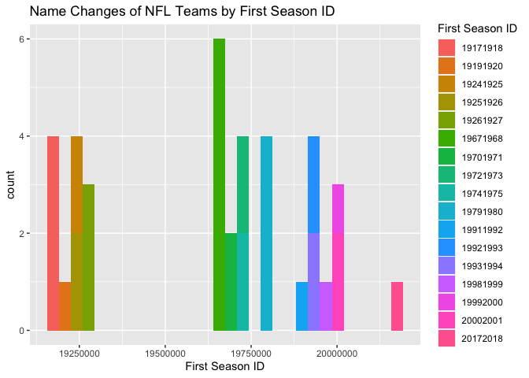
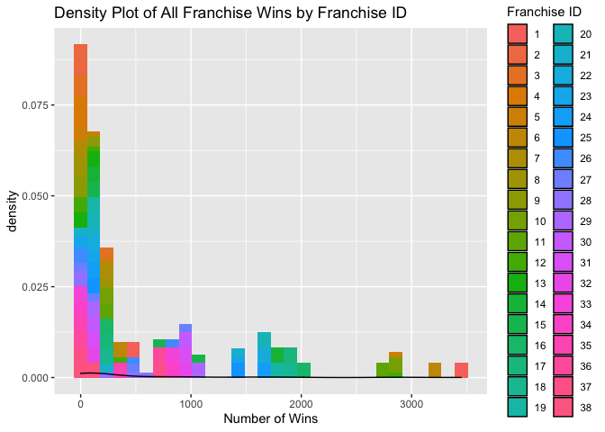
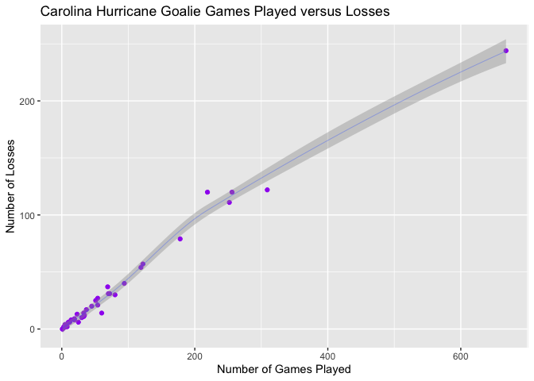
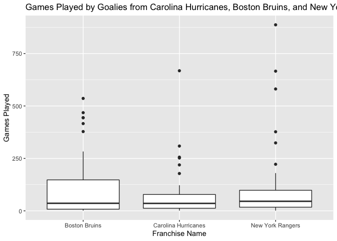

Project 1 - Karen Lopez
================
September 18, 2020

-   [Reading and Summarizing Data from the NHL’s
    API](#reading-and-summarizing-data-from-the-nhls-api)
    -   [Required Packages](#required-packages)
    -   [Make Contact and Get Data](#make-contact-and-get-data)
        -   [Franchise API](#franchise-api)
        -   [Stats API](#stats-api)
    -   [Wrapper Function](#wrapper-function)
    -   [Exploratory Analysis](#exploratory-analysis)
        -   [A Join](#a-join)
        -   [New Variables](#new-variables)
        -   [Contingency Tables](#contingency-tables)
        -   [Numeric Summaries](#numeric-summaries)
        -   [Plots](#plots)

Reading and Summarizing Data from the NHL’s API
===============================================

This vignette was compiled to provide detailed instructions on reading
and summarizing data from the National Hockey League’s, or NHL’s, API
using R code.

Required Packages
-----------------

First, install and read in the necessary packages, as shown below.
Packages only need to be installed once, but code is included in
comment.

    #install.packages("tidyverse")
    library(tidyverse)
    library(httr)
    library(jsonlite)
    library(dplyr)
    library(knitr)

Make Contact and Get Data
-------------------------

This code contains functions that will contact the [NHL records
API](https://gitlab.com/dword4/nhlapi/-/blob/master/records-api.md) and
[NHL stat
API](https://gitlab.com/dword4/nhlapi/-/blob/master/stats-api.md), and
return parsed, well-formatted data.

### Franchise API

    #function that creates the url for the records API
    getUrl <- function(input){
      baseUrl <- "https://records.nhl.com/site/api/franchise"
      fullURL <- paste0(baseUrl, input) #create url
    }

    franchise <- function(){
      franchiseAPI <- GET(getUrl(NULL)) #get url & data
      franchiseAPI #check connection
      franchiseText <- content(franchiseAPI, "text") #convert to JSON text form
      franchiseList <- fromJSON(franchiseText, flatten=TRUE) #convert form
      franchiseDF <- as.data.frame(franchiseList) #convert to df, adds .data to col names
      colnames(franchiseDF) <- c("id", "firstSeasonId", "lastSeasonId", "mostRecentTeamId", "teamCommonName", "teamPlaceName", "total") #rename columns
      
      return(franchiseDF)
    }
    franchiseData <- franchise() #save data frame object (used in other functions later)
    print(kable(head(franchiseData))) #view first 6 rows

    ## 
    ## 
    ## | id| firstSeasonId| lastSeasonId| mostRecentTeamId|teamCommonName |teamPlaceName | total|
    ## |--:|-------------:|------------:|----------------:|:--------------|:-------------|-----:|
    ## |  1|      19171918|           NA|                8|Canadiens      |Montréal      |    38|
    ## |  2|      19171918|     19171918|               41|Wanderers      |Montreal      |    38|
    ## |  3|      19171918|     19341935|               45|Eagles         |St. Louis     |    38|
    ## |  4|      19191920|     19241925|               37|Tigers         |Hamilton      |    38|
    ## |  5|      19171918|           NA|               10|Maple Leafs    |Toronto       |    38|
    ## |  6|      19241925|           NA|                6|Bruins         |Boston        |    38|

    teamTotals <- function(){
      teamAPI <- GET(getUrl("-team-totals")) #get url & data
      teamText <- content(teamAPI, "text") #convert to JSON text form
      teamList <- fromJSON(teamText, flatten=TRUE) #convert form
      teamDF <- as.data.frame(teamList) #convert to df, adds .data to col names
      colnames(teamDF) <- c("id", "activeFranchise", "firstSeasonId", "franchiseId", "gameTypeId", "gamesPlayed", "goalsAgainst", "goalsFor", "homeLosses", "homeOvertimeLosses", "homeTies", "homeWins", "lastSeasonId", "losses","overtimeLosses", "penaltyMinutes", "pointPctg", "points", "roadLosses", "roadOvertimeLosses", "roadTies", "roadWins", "shootoutLosses", "shootoutWins",  "shutouts", "teamId", "teamName", "ties", "triCode", "wins", "total") #rename columns
      
      return(teamDF)
    }
    teamsT <- teamTotals() #test that function works
    print(kable(head(teamsT)))  #view first 6 rows

    ## 
    ## 
    ## | id| activeFranchise| firstSeasonId| franchiseId| gameTypeId| gamesPlayed| goalsAgainst| goalsFor| homeLosses| homeOvertimeLosses| homeTies| homeWins| lastSeasonId| losses| overtimeLosses| penaltyMinutes| pointPctg| points| roadLosses| roadOvertimeLosses| roadTies| roadWins| shootoutLosses| shootoutWins| shutouts| teamId|teamName           | ties|triCode | wins| total|
    ## |--:|---------------:|-------------:|-----------:|----------:|-----------:|------------:|--------:|----------:|------------------:|--------:|--------:|------------:|------:|--------------:|--------------:|---------:|------:|----------:|------------------:|--------:|--------:|--------------:|------------:|--------:|------:|:------------------|----:|:-------|----:|-----:|
    ## |  1|               1|      19821983|          23|          2|        2937|         8708|     8647|        507|                 82|       96|      783|           NA|   1181|            162|          44397|    0.5330|   3131|        674|                 80|      123|      592|             79|           78|      193|      1|New Jersey Devils  |  219|NJD     | 1375|   105|
    ## |  2|               1|      19821983|          23|          3|         257|          634|      697|         53|                  0|       NA|       74|           NA|    120|              0|           4266|    0.0039|      2|         67|                  0|       NA|       63|              0|            0|       25|      1|New Jersey Devils  |   NA|NJD     |  137|   105|
    ## |  3|               1|      19721973|          22|          2|        3732|        11779|    11889|        674|                 81|      170|      942|           NA|   1570|            159|          57422|    0.5115|   3818|        896|                 78|      177|      714|             67|           82|      167|      2|New York Islanders |  347|NYI     | 1656|   105|
    ## |  4|               1|      19721973|          22|          3|         294|          857|      935|         50|                  3|       NA|       90|           NA|    133|              0|           5564|    0.0136|      8|         83|                  2|       NA|       71|              0|            0|       12|      2|New York Islanders |   NA|NYI     |  161|   105|
    ## |  5|               1|      19261927|          10|          2|        6504|        19863|    19864|       1132|                 73|      448|     1600|           NA|   2693|            147|          85564|    0.5125|   6667|       1561|                 74|      360|     1256|             66|           78|      403|      3|New York Rangers   |  808|NYR     | 2856|   105|
    ## |  6|               1|      19261927|          10|          3|         518|         1447|     1404|        104|                  0|        1|      137|           NA|    266|              0|           8181|    0.0000|      0|        162|                  0|        7|      107|              0|            0|       44|      3|New York Rangers   |    8|NYR     |  244|   105|

    #function that returns numeric team ID when supplied with team name
    getID <- function(teamName){
      teamData <- data.frame()
      teamID <- NULL
      #searches for team name in both columns and returns numeric id, as asks for valid input
      if(teamName %in% franchiseData$teamCommonName){
        teamData <- franchiseData %>% filter(franchiseData$teamCommonName==teamName)
        teamID <- teamData$id
      } else if(teamName %in% franchiseData$teamPlaceName){
        teamData <- franchiseData %>% filter(franchiseData$teamPlaceName==teamName)
        teamID <- teamData$id
      } else {print("Please enter valid team name.")}
      return(teamID)
    }

    seasonRecords <- function(ID){
      url <- ""
      #creates url basted on input ID
      if(is.numeric(ID)){
        url <- paste0("-season-records?cayenneExp=franchiseId=", ID)
      } else if(is.character(ID)){
        ID = getID(ID)
        url <- paste0("-season-records?cayenneExp=franchiseId=", ID)
      }
      seasonAPI <- GET(getUrl(url)) #get url & data
      seasonText <- content(seasonAPI, "text") #convert to JSON text form
      seasonList <- fromJSON(seasonText, flatten=TRUE) #convert form
      seasonDF <- as.data.frame(seasonList) #convert to df, adds .data to col names
      colnames(seasonDF) <- c("id", "fewestGoals", "fewestGoalsAgainst", "fewestGoalsAgainstSeasons", "fewestGoalsSeasons", "fewestLosses", "fewestLossesSeasons", "fewestPoints", "fewestPointsSeasons", "fewestTies", "fewestTiesSeasons", "fewestWins", "fewestWinsSeasons", "franchiseId", "franchiseName", "homeLossStreak", "homeLossStreakDates", "homePointStreak", "homePointStreakDates", "homeWinStreak", "homeWinStreakDates", "homeWinlessStreak", "homeWinlessStreakDates", "lossStreak", "lossStreakDates", "mostGameGoals", "mostGameGoalsDates", "mostGoals", "mostGoalsAgainst", "mostGoalsAgainstSeasons", "mostGoalsSeasons", "mostLosses", "mostLossesSeasons", "mostPenaltyMinutes", "mostPenaltyMinutesSeasons", "mostPoints", "mostPointsSeasons", "mostShutouts", "mostShutoutsSeasons", "mostTies", "mostTiesSeasons", "mostWins", "mostWinsSeasons", "pointStreak", "pointStreakDates", "roadLossStreak", "roadLossStreakDates", "roadPointStreak", "roadPointStreakDates", "roadWinStreak", "roadWinStreakDates", "roadWinlessStreak", "roadWinlessStreakDates", "winStreak", "winStreakDates", "winlessStreak", "winlessStreakDates") #change df col names

      return(seasonDF)
    }
    seasonRecord <- seasonRecords("Carolina") #test that function works
    print(kable(head(seasonRecord)))

    ## 
    ## 
    ## | id| fewestGoals| fewestGoalsAgainst|fewestGoalsAgainstSeasons |fewestGoalsSeasons | fewestLosses|fewestLossesSeasons | fewestPoints|fewestPointsSeasons | fewestTies|fewestTiesSeasons | fewestWins|fewestWinsSeasons | franchiseId|franchiseName       | homeLossStreak|homeLossStreakDates       | homePointStreak|homePointStreakDates      | homeWinStreak|homeWinStreakDates        | homeWinlessStreak|homeWinlessStreakDates    | lossStreak|lossStreakDates           | mostGameGoals|mostGameGoalsDates                                                                                                     | mostGoals| mostGoalsAgainst|mostGoalsAgainstSeasons |mostGoalsSeasons | mostLosses|mostLossesSeasons | mostPenaltyMinutes|mostPenaltyMinutesSeasons | mostPoints|mostPointsSeasons | mostShutouts|mostShutoutsSeasons | mostTies|mostTiesSeasons | mostWins|mostWinsSeasons | pointStreak|pointStreakDates          | roadLossStreak|roadLossStreakDates       | roadPointStreak|roadPointStreakDates      | roadWinStreak|roadWinStreakDates        | roadWinlessStreak|roadWinlessStreakDates                               | winStreak|winStreakDates                                                                  |winlessStreak |winlessStreakDates | NA|
    ## |--:|-----------:|------------------:|:-------------------------|:------------------|------------:|:-------------------|------------:|:-------------------|----------:|:-----------------|----------:|:-----------------|-----------:|:-------------------|--------------:|:-------------------------|---------------:|:-------------------------|-------------:|:-------------------------|-----------------:|:-------------------------|----------:|:-------------------------|-------------:|:----------------------------------------------------------------------------------------------------------------------|---------:|----------------:|:-----------------------|:----------------|----------:|:-----------------|------------------:|:-------------------------|----------:|:-----------------|------------:|:-------------------|--------:|:---------------|--------:|:---------------|-----------:|:-------------------------|--------------:|:-------------------------|---------------:|:-------------------------|-------------:|:-------------------------|-----------------:|:----------------------------------------------------|---------:|:-------------------------------------------------------------------------------|:-------------|:------------------|--:|
    ## | 12|         171|                202|1998-99 (82)              |2002-03 (82)       |           22|2005-06 (82)        |           45|1982-83 (80)        |          4|1985-86 (80)      |         19|1982-83 (80)      |          26|Carolina Hurricanes |              8|Mar 14 2013 - Apr 09 2013 |              15|Dec 13 2005 - Jan 28 2006 |            12|Feb 20 2009 - Apr 07 2009 |                13|Jan 15 1985 - Mar 10 1985 |          9|Feb 19 1983 - Mar 08 1983 |            11|Feb 12 1984 - EDM 0 @ HFD 11, Oct 19 1985 - MTL 6 @ HFD 11, Jan 17 1986 - QUE 6 @ HFD 11, Mar 15 1986 - CHI 4 @ HFD 11 |       332|              403|1982-83 (80)            |1985-86 (80)     |         54|1982-83 (80)      |               2354|1992-93 (84)              |        112|2005-06 (82)      |            8|1998-99 (82)        |       19|1979-80 (80)    |       52|2005-06 (82)    |          13|Mar 09 2017 - Mar 30 2017 |             13|Dec 18 1982 - Feb 05 1983 |              12|Feb 23 2004 - Mar 27 2004 |             6|Nov 10 1990 - Dec 07 1990 |                15|Nov 11 1979 - Jan 09 1980, Jan 07 2003 - Mar 02 2003 |         9|Oct 22 2005 - Nov 11 2005, Dec 31 2005 - Jan 19 2006, Mar 18 2009 - Apr 07 2009 |NA            |NA                 |  1|

    goalieRecords <- function(ID){
      url <- ""
      #creates url basted on input ID
      if(is.numeric(ID)){
        url <- paste0("-goalie-records?cayenneExp=franchiseId=", ID)
      } else if(is.character(ID)){
        ID = getID(ID)
        url <- paste0("-goalie-records?cayenneExp=franchiseId=", ID)
      }
      goalieAPI <- GET(getUrl(url)) #get url & data
      goalieText <- content(goalieAPI, "text") #convert to JSON text form
      goalieList <- fromJSON(goalieText, flatten=TRUE) #convert form
      goalieDF <- as.data.frame(goalieList) #convert to df, adds .data to col names
      colnames(goalieDF) <- c("id", "activePlayer", "firstName", "franchiseId", "franchiseName", "gameTypeId", "gamesPlayed", "lastName", "losses", "mostGoalsAgainstDates", "mostGoalsAgainstOneGame", "mostSavesDates", "mostSavesOneGame", "mostShotsAgainstDates", "mostShotsAgainstOneGame", "mostShutoutsOneSeason", "mostShutoutsSeasonIds", "mostWinsOneSeason", "mostWinsSeasonIds", "overtimeLosses", "playerId", "positionCode", "rookieGamesPlayed", "rookieShutouts", "rookieWins", "seasons", "shutouts", "ties", "dwins", "total") #change df col names

      return(goalieDF)
    }
    goalieRecord <- goalieRecords("Carolina") #test that function works
    print(kable(head(goalieRecord)))

    ## 
    ## 
    ## |  id|activePlayer |firstName | franchiseId|franchiseName       | gameTypeId| gamesPlayed|lastName    | losses|mostGoalsAgainstDates              | mostGoalsAgainstOneGame|mostSavesDates | mostSavesOneGame|mostShotsAgainstDates  | mostShotsAgainstOneGame| mostShutoutsOneSeason|mostShutoutsSeasonIds | mostWinsOneSeason|mostWinsSeasonIds | overtimeLosses| playerId|positionCode | rookieGamesPlayed| rookieShutouts| rookieWins| seasons| shutouts| ties| dwins| total|
    ## |---:|:------------|:---------|-----------:|:-------------------|----------:|-----------:|:-----------|------:|:----------------------------------|-----------------------:|:--------------|----------------:|:----------------------|-----------------------:|---------------------:|:---------------------|-----------------:|:-----------------|--------------:|--------:|:------------|-----------------:|--------------:|----------:|-------:|--------:|----:|-----:|-----:|
    ## | 277|FALSE        |Cam       |          26|Carolina Hurricanes |          2|         668|Ward        |    244|2017-01-20, 2007-01-27, 2005-11-12 |                       7|2008-10-25     |               57|2008-10-25             |                      60|                     6|20082009              |                39|20082009          |             84|  8470320|G            |                28|              0|         14|      13|       27|    0|   318|    38|
    ## | 310|FALSE        |Arturs    |          26|Carolina Hurricanes |          2|         309|Irbe        |    122|2002-01-12                         |                       7|1999-01-30     |               44|1999-01-30             |                      45|                     6|19981999, 20002001    |                37|20002001          |             NA|  8456692|G            |                NA|             NA|         NA|       6|       20|   44|   130|    38|
    ## | 336|FALSE        |Tom       |          26|Carolina Hurricanes |          2|          34|Barrasso    |     12|2001-12-30, 2001-12-18, 2001-11-29 |                       5|2001-12-10     |               40|2001-12-10             |                      43|                     2|20012002              |                13|20012002          |             NA|  8445275|G            |                NA|             NA|         NA|       1|        2|    5|    13|    38|
    ## | 363|FALSE        |Richard   |          26|Carolina Hurricanes |          2|           6|Brodeur     |      2|1988-03-09                         |                       4|1988-04-03     |               31|1988-04-03             |                      34|                     0|19871988              |                 4|19871988          |             NA|  8445694|G            |                NA|             NA|         NA|       1|        0|    0|     4|    38|
    ## | 369|FALSE        |Sean      |          26|Carolina Hurricanes |          2|         256|Burke       |    120|1992-12-11                         |                       9|1994-01-01     |               51|1996-01-27, 1994-01-01 |                      54|                     4|19951996, 19961997    |                28|19951996          |             NA|  8445769|G            |                NA|             NA|         NA|       6|       10|   24|   100|    38|
    ## | 411|FALSE        |Mark      |          26|Carolina Hurricanes |          2|           3|Fitzpatrick |      2|2000-02-15                         |                       5|2000-02-15     |               40|2000-02-15             |                      45|                     0|19992000              |                 0|19992000          |             NA|  8446829|G            |                NA|             NA|         NA|       1|        0|    0|     0|    38|

    skaterRecords <- function(ID){
      url <- ""
      #creates url basted on input ID
      if(is.numeric(ID)){
        url <- paste0("-skater-records?cayenneExp=franchiseId=", ID)
      } else if(is.character(ID)){
        ID = getID(ID)
        url <- paste0("-skater-records?cayenneExp=franchiseId=", ID)
      }
      skaterAPI <- GET(getUrl(url)) #get url & data
      skaterText <- content(skaterAPI, "text") #convert to JSON text form
      skaterList <- fromJSON(skaterText, flatten=TRUE) #convert form
      skaterDF <- as.data.frame(skaterList) #convert to df, adds .data to col names

      colnames(skaterDF) <- c("id", "activePlayer", "assists", "firstName", "franchiseId", "franchiseName", "gameTypeId", "gamesPlayed", "goals", "lastName", "mostAssistsGameDates", "mostAssistsOneGame", "mostAssistsOneSeason", "mostAssistsSeasonIds", "mostGoalsGameDates", "mostGoalsOneGame", "mostGoalsOneSeason", "mostGoalsSeasonIds", "mostPenaltyMinutesOneSeason", "mostPenaltyMinutesSeasonIds", "mostPointsGameDates", "mostPointsOneGame", "mostPointsOneSeason", "mostPointsSeasonIds", "penaltyMinutes", "playerId", "points", "positionCode", "rookiePoints", "seasons", "total") #change df col names

      return(skaterDF)
    }
    skaterRecord <- skaterRecords(9) #test that function works
    print(kable(head(skaterRecord)))

    ## 
    ## 
    ## |    id|activePlayer | assists|firstName | franchiseId|franchiseName        | gameTypeId| gamesPlayed| goals|lastName |mostAssistsGameDates                                                                                                                                                                                                                                                                                                                                                                                                                                                                                                                           | mostAssistsOneGame| mostAssistsOneSeason|mostAssistsSeasonIds |mostGoalsGameDates                                                                                                                                                                                                                                                                                                                                                                                                                                                                                                                             | mostGoalsOneGame| mostGoalsOneSeason|mostGoalsSeasonIds | mostPenaltyMinutesOneSeason|mostPenaltyMinutesSeasonIds |mostPointsGameDates                                                                                                                                                                                                                                                                                                                                                                                                                                                                                                                            | mostPointsOneGame| mostPointsOneSeason|mostPointsSeasonIds | penaltyMinutes| playerId| points|positionCode | rookiePoints| seasons| total|
    ## |-----:|:------------|-------:|:---------|-----------:|:--------------------|----------:|-----------:|-----:|:--------|:----------------------------------------------------------------------------------------------------------------------------------------------------------------------------------------------------------------------------------------------------------------------------------------------------------------------------------------------------------------------------------------------------------------------------------------------------------------------------------------------------------------------------------------------|------------------:|--------------------:|:--------------------|:----------------------------------------------------------------------------------------------------------------------------------------------------------------------------------------------------------------------------------------------------------------------------------------------------------------------------------------------------------------------------------------------------------------------------------------------------------------------------------------------------------------------------------------------|----------------:|------------------:|:------------------|---------------------------:|:---------------------------|:----------------------------------------------------------------------------------------------------------------------------------------------------------------------------------------------------------------------------------------------------------------------------------------------------------------------------------------------------------------------------------------------------------------------------------------------------------------------------------------------------------------------------------------------|-----------------:|-------------------:|:-------------------|--------------:|--------:|------:|:------------|------------:|-------:|-----:|
    ## | 16893|FALSE        |      33|Harold    |           9|Philadelphia Quakers |          2|         216|    60|Darragh  |1926-01-19, 1929-11-19, 1929-11-23, 1929-12-10, 1930-01-18                                                                                                                                                                                                                                                                                                                                                                                                                                                                                     |                  2|                   17|19291930             |1927-03-20, 1928-03-12, 1928-03-17, 1929-11-16, 1930-01-18, 1930-02-01, 1930-02-22                                                                                                                                                                                                                                                                                                                                                                                                                                                             |                2|                 15|19291930           |                           8|19271928, 19291930          |1930-01-18                                                                                                                                                                                                                                                                                                                                                                                                                                                                                                                                     |                 4|                  32|19291930            |             32|  8445843|     93|L            |           17|       6|    38|
    ## | 16894|FALSE        |      13|Herb      |           9|Philadelphia Quakers |          2|         216|    24|Drury    |1926-02-06, 1926-03-04, 1926-11-20, 1927-03-08, 1927-12-31, 1928-03-17, 1929-02-14, 1929-02-21, 1929-03-05, 1929-03-17, 1930-12-09, 1931-02-05, 1931-02-14                                                                                                                                                                                                                                                                                                                                                                                     |                  1|                    4|19281929             |1925-12-09, 1928-02-14, 1930-03-18                                                                                                                                                                                                                                                                                                                                                                                                                                                                                                             |                2|                  6|19251926, 19271928 |                          54|19261927                    |1925-12-09, 1926-02-06, 1928-02-14, 1930-03-18                                                                                                                                                                                                                                                                                                                                                                                                                                                                                                 |                 2|                   9|19281929            |            223|  8445955|     37|D            |            8|       6|    38|
    ## | 16905|FALSE        |      34|Hib       |           9|Philadelphia Quakers |          2|         253|    88|Milks    |1927-01-18, 1928-11-20, 1929-12-05, 1931-03-21                                                                                                                                                                                                                                                                                                                                                                                                                                                                                                 |                  2|                   11|19291930             |1926-03-04                                                                                                                                                                                                                                                                                                                                                                                                                                                                                                                                     |                4|                 18|19271928, 19301931 |                          42|19301931                    |1926-03-04                                                                                                                                                                                                                                                                                                                                                                                                                                                                                                                                     |                 4|                  24|19291930, 19301931  |            167|  8447859|    122|L            |           19|       6|    38|
    ## | 16918|FALSE        |       4|Rodger    |           9|Philadelphia Quakers |          2|         210|    20|Smith    |1925-12-09, 1929-01-03, 1929-03-05, 1930-01-02                                                                                                                                                                                                                                                                                                                                                                                                                                                                                                 |                  1|                    2|19281929             |1926-01-15                                                                                                                                                                                                                                                                                                                                                                                                                                                                                                                                     |                3|                  9|19251926           |                          69|19291930                    |1926-01-15                                                                                                                                                                                                                                                                                                                                                                                                                                                                                                                                     |                 3|                  10|19251926            |            180|  8449082|     24|D            |           10|       6|    38|
    ## | 16922|FALSE        |      13|Tex       |           9|Philadelphia Quakers |          2|         194|    32|White    |1926-02-23, 1927-01-01, 1927-02-15, 1927-03-17, 1927-03-26, 1927-12-22, 1928-01-16, 1928-03-24, 1928-11-18, 1928-12-01, 1929-01-01, 1929-01-24, 1930-01-25                                                                                                                                                                                                                                                                                                                                                                                     |                  1|                    4|19261927, 19281929   |1929-12-14                                                                                                                                                                                                                                                                                                                                                                                                                                                                                                                                     |                2|                  8|19291930           |                          54|19271928                    |1927-03-17, 1927-03-26, 1929-12-14                                                                                                                                                                                                                                                                                                                                                                                                                                                                                                             |                 2|                   9|19261927, 19291930  |            135|  8449392|     45|R            |            8|       6|    38|
    ## | 17095|FALSE        |       0|D'arcy    |           9|Philadelphia Quakers |          2|          28|     0|Coulson  |1930-11-11, 1930-11-15, 1930-11-16, 1930-11-18, 1930-11-23, 1930-11-25, 1930-11-29, 1930-12-02, 1930-12-04, 1930-12-06, 1930-12-09, 1930-12-13, 1930-12-16, 1930-12-20, 1930-12-23, 1930-12-25, 1930-12-28, 1931-01-01, 1931-01-03, 1931-01-04, 1931-01-08, 1931-01-10, 1931-01-13, 1931-01-17, 1931-01-20, 1931-01-22, 1931-01-24, 1931-01-27, 1931-01-29, 1931-01-31, 1931-02-05, 1931-02-10, 1931-02-14, 1931-02-17, 1931-02-22, 1931-02-24, 1931-02-28, 1931-03-03, 1931-03-07, 1931-03-10, 1931-03-12, 1931-03-14, 1931-03-17, 1931-03-21 |                  0|                    0|19301931             |1930-11-11, 1930-11-15, 1930-11-16, 1930-11-18, 1930-11-23, 1930-11-25, 1930-11-29, 1930-12-02, 1930-12-04, 1930-12-06, 1930-12-09, 1930-12-13, 1930-12-16, 1930-12-20, 1930-12-23, 1930-12-25, 1930-12-28, 1931-01-01, 1931-01-03, 1931-01-04, 1931-01-08, 1931-01-10, 1931-01-13, 1931-01-17, 1931-01-20, 1931-01-22, 1931-01-24, 1931-01-27, 1931-01-29, 1931-01-31, 1931-02-05, 1931-02-10, 1931-02-14, 1931-02-17, 1931-02-22, 1931-02-24, 1931-02-28, 1931-03-03, 1931-03-07, 1931-03-10, 1931-03-12, 1931-03-14, 1931-03-17, 1931-03-21 |                0|                  0|19301931           |                         103|19301931                    |1930-11-11, 1930-11-15, 1930-11-16, 1930-11-18, 1930-11-23, 1930-11-25, 1930-11-29, 1930-12-02, 1930-12-04, 1930-12-06, 1930-12-09, 1930-12-13, 1930-12-16, 1930-12-20, 1930-12-23, 1930-12-25, 1930-12-28, 1931-01-01, 1931-01-03, 1931-01-04, 1931-01-08, 1931-01-10, 1931-01-13, 1931-01-17, 1931-01-20, 1931-01-22, 1931-01-24, 1931-01-27, 1931-01-29, 1931-01-31, 1931-02-05, 1931-02-10, 1931-02-14, 1931-02-17, 1931-02-22, 1931-02-24, 1931-02-28, 1931-03-03, 1931-03-07, 1931-03-10, 1931-03-12, 1931-03-14, 1931-03-17, 1931-03-21 |                 0|                   0|19301931            |            103|  8445741|      0|D            |            0|       1|    38|

### Stats API

The user is required to input a team ID or name and modifier to access
the desired data. This string input format isn’t ideal, but is corrected
in the wrapper function.  
Input guide for modifiers, copied from API website:

-   ?expand=team.roster Shows roster of active players for the specified
    team  
-   ?expand=person.names Same as above, but gives less info  
-   ?expand=team.schedule.next Returns details of the upcoming game for
    a team  
-   ?expand=team.schedule.previous Same as above but for the last game
    played  
-   ?expand=team.stats Returns the teams stats for the season  
-   ?expand=team.roster&season=20142015 Adding the season identifier
    shows the roster for that season  
-   ?teamId=4,5,29 Can string team id together to get multiple teams

<!-- -->

    #from stats API
    teams <- function(ID, input){
      url <- ""
      #creates url basted on input ID
      if(is.numeric(ID)){
        url <- paste0("https://statsapi.web.nhl.com/api/v1/teams/", ID, "/", input)
      } else if(is.character(ID)){
        ID = getID(ID)
        url <- paste0("https://statsapi.web.nhl.com/api/v1/teams/", ID, "/", input)
      }
      teamsAPI <- GET(url)
      teamsText <- content(teamsAPI, "text") #convert to JSON text form
      teamsList <- fromJSON(teamsText, flatten=TRUE) #convert form
      teamsDF <- as.data.frame(teamsList) #convert to df

      return(teamsDF)
    }
    teamsRecord <- teams(12,"?expand=person.names") #test that function works
    print(kable(teamsRecord))

    ## 
    ## 
    ## |copyright                                                                                                                                                                          | teams.id|teams.name          |teams.link       |teams.abbreviation |teams.teamName |teams.locationName |teams.firstYearOfPlay |teams.shortName |teams.officialSiteUrl              | teams.franchiseId|teams.active | teams.venue.id|teams.venue.name |teams.venue.link    |teams.venue.city |teams.venue.timeZone.id | teams.venue.timeZone.offset|teams.venue.timeZone.tz | teams.division.id|teams.division.name |teams.division.nameShort |teams.division.link  |teams.division.abbreviation | teams.conference.id|teams.conference.name |teams.conference.link | teams.franchise.franchiseId|teams.franchise.teamName |teams.franchise.link  |
    ## |:----------------------------------------------------------------------------------------------------------------------------------------------------------------------------------|--------:|:-------------------|:----------------|:------------------|:--------------|:------------------|:---------------------|:---------------|:----------------------------------|-----------------:|:------------|--------------:|:----------------|:-------------------|:----------------|:-----------------------|---------------------------:|:-----------------------|-----------------:|:-------------------|:------------------------|:--------------------|:---------------------------|-------------------:|:---------------------|:---------------------|---------------------------:|:------------------------|:---------------------|
    ## |NHL and the NHL Shield are registered trademarks of the National Hockey League. NHL and NHL team marks are the property of the NHL and its teams. © NHL 2020. All Rights Reserved. |       12|Carolina Hurricanes |/api/v1/teams/12 |CAR                |Hurricanes     |Carolina           |1979                  |Carolina        |http://www.carolinahurricanes.com/ |                26|TRUE         |           5066|PNC Arena        |/api/v1/venues/5066 |Raleigh          |America/New_York        |                          -4|EDT                     |                18|Metropolitan        |Metro                    |/api/v1/divisions/18 |M                           |                   6|Eastern               |/api/v1/conferences/6 |                          26|Hurricanes               |/api/v1/franchises/26 |

    teamsRecord2 <- teams(54,"?expand=team.schedule.next") #test that function works
    print(kable(teamsRecord2))

    ## 
    ## 
    ## |copyright                                                                                                                                                                          | teams.id|teams.name           |teams.link       |teams.abbreviation |teams.teamName |teams.locationName |teams.firstYearOfPlay |teams.shortName |teams.officialSiteUrl              | teams.franchiseId|teams.active | teams.venue.id|teams.venue.name |teams.venue.link    |teams.venue.city |teams.venue.timeZone.id | teams.venue.timeZone.offset|teams.venue.timeZone.tz | teams.division.id|teams.division.name |teams.division.nameShort |teams.division.link  |teams.division.abbreviation | teams.conference.id|teams.conference.name |teams.conference.link | teams.franchise.franchiseId|teams.franchise.teamName |teams.franchise.link  |
    ## |:----------------------------------------------------------------------------------------------------------------------------------------------------------------------------------|--------:|:--------------------|:----------------|:------------------|:--------------|:------------------|:---------------------|:---------------|:----------------------------------|-----------------:|:------------|--------------:|:----------------|:-------------------|:----------------|:-----------------------|---------------------------:|:-----------------------|-----------------:|:-------------------|:------------------------|:--------------------|:---------------------------|-------------------:|:---------------------|:---------------------|---------------------------:|:------------------------|:---------------------|
    ## |NHL and the NHL Shield are registered trademarks of the National Hockey League. NHL and NHL team marks are the property of the NHL and its teams. © NHL 2020. All Rights Reserved. |       54|Vegas Golden Knights |/api/v1/teams/54 |VGK                |Golden Knights |Vegas              |2016                  |Vegas           |http://www.vegasgoldenknights.com/ |                38|TRUE         |           5178|T-Mobile Arena   |/api/v1/venues/5178 |Las Vegas        |America/Los_Angeles     |                          -7|PDT                     |                15|Pacific             |PAC                      |/api/v1/divisions/15 |P                           |                   5|Western               |/api/v1/conferences/5 |                          38|Golden Knights           |/api/v1/franchises/38 |

    #API returns the same team information table across the different modifiers with nested data frame(s) that contain the modifier data. On the discussion board, the instructor noted we can print the output as is and that we shouldn't worry about the last modifier, so I omitted modifier 13 (?stats=statsSingleSeasonPlayoffs).

Wrapper Function
----------------

This wrapper function allows the user to access any of the API endpoints
and modifiers included in the above code. The user must input the
endpoint and team ID or name, where team input is applicable. The
endpoints have been coded by numerbers, making user input more friendly.

Endpoint input guide, number 1-5 are from the Records API and numbers
6-12 are from the Stats API:  
- 1: franchise information for all teams  
- 2: team totals for all teams  
- 3: season records for a team (must specify team ID or name)  
- 4: goalie records for a team (must specify team ID or name)  
- 5: skater records for a team (must specify team ID or name)  
- 6: team roster of active players for a team (must specify team ID or
name)  
- 7: active player names for a team (must specify team ID or name)  
- 8: upcoming game for a team (must specify team ID or name)  
- 9: last game played for a team (must specify team ID or name)  
- 10: season stats for a team (must specify team ID or name)  
- 11: roster by season for a team (must specify team ID or name)  
- 12: franchise information for multiple teams (must specify team IDs or
names)

    #function to access endpoints of stats API
    accessAPI <- function(endpoint, team=NULL){
      outputDF <- NULL #create output object
      
      #check if team name is character or valid number, get numeric ID if character
      if(is.null(team)){
      } else if(is.character(team)){
        team = getID(team)
      } else if(!is.numeric(team)){
        print("Please enter valid team name or ID.")
      }
      
      #check if endpoint is valid, get url based on endpoint input
      if(endpoint==1){
        outputDF <- franchise()
      } else if(endpoint==2){
        outputDF <- teamTotals()
      } else if(endpoint==3){
        outputDF <- seasonRecords(team)
      } else if(endpoint==4){
        outputDF <- goalieRecords(team)
      } else if(endpoint==5){
        outputDF <- skaterRecords(team)
      } else if(endpoint==6){
        outputDF <- teams(team, "?expand=team.roster")
      } else if(endpoint==7){
        outputDF <- teams(team, "?expand=person.names")
      } else if(endpoint==8){
        outputDF <- teams(team, "?expand=team.schedule.next")
      } else if(endpoint==9){
        outputDF <- teams(team, "?expand=team.schedule.previous")
      } else if(endpoint==10){
        outputDF <- teams(team, "?expand=team.stats")
      } else if(endpoint==11){
        outputDF <- teams(team, "?expand=team.roster&season=20142015")
      } else if(endpoint==12){
        outputDF <- teams(team, "?teamId=4,5,29")
      } else {
        print("Please enter a valid number endpoint or modifier between 1 and 13.")
      }
    return(outputDF)
    }
    #test code, all work
    franchise1 <- accessAPI(1)
    print(kable(head(franchise1)))

    ## 
    ## 
    ## | id| firstSeasonId| lastSeasonId| mostRecentTeamId|teamCommonName |teamPlaceName | total|
    ## |--:|-------------:|------------:|----------------:|:--------------|:-------------|-----:|
    ## |  1|      19171918|           NA|                8|Canadiens      |Montréal      |    38|
    ## |  2|      19171918|     19171918|               41|Wanderers      |Montreal      |    38|
    ## |  3|      19171918|     19341935|               45|Eagles         |St. Louis     |    38|
    ## |  4|      19191920|     19241925|               37|Tigers         |Hamilton      |    38|
    ## |  5|      19171918|           NA|               10|Maple Leafs    |Toronto       |    38|
    ## |  6|      19241925|           NA|                6|Bruins         |Boston        |    38|

    goalie1<- accessAPI(4, "Carolina")
    print(kable(head(goalie1)))

    ## 
    ## 
    ## |  id|activePlayer |firstName | franchiseId|franchiseName       | gameTypeId| gamesPlayed|lastName    | losses|mostGoalsAgainstDates              | mostGoalsAgainstOneGame|mostSavesDates | mostSavesOneGame|mostShotsAgainstDates  | mostShotsAgainstOneGame| mostShutoutsOneSeason|mostShutoutsSeasonIds | mostWinsOneSeason|mostWinsSeasonIds | overtimeLosses| playerId|positionCode | rookieGamesPlayed| rookieShutouts| rookieWins| seasons| shutouts| ties| dwins| total|
    ## |---:|:------------|:---------|-----------:|:-------------------|----------:|-----------:|:-----------|------:|:----------------------------------|-----------------------:|:--------------|----------------:|:----------------------|-----------------------:|---------------------:|:---------------------|-----------------:|:-----------------|--------------:|--------:|:------------|-----------------:|--------------:|----------:|-------:|--------:|----:|-----:|-----:|
    ## | 277|FALSE        |Cam       |          26|Carolina Hurricanes |          2|         668|Ward        |    244|2017-01-20, 2007-01-27, 2005-11-12 |                       7|2008-10-25     |               57|2008-10-25             |                      60|                     6|20082009              |                39|20082009          |             84|  8470320|G            |                28|              0|         14|      13|       27|    0|   318|    38|
    ## | 310|FALSE        |Arturs    |          26|Carolina Hurricanes |          2|         309|Irbe        |    122|2002-01-12                         |                       7|1999-01-30     |               44|1999-01-30             |                      45|                     6|19981999, 20002001    |                37|20002001          |             NA|  8456692|G            |                NA|             NA|         NA|       6|       20|   44|   130|    38|
    ## | 336|FALSE        |Tom       |          26|Carolina Hurricanes |          2|          34|Barrasso    |     12|2001-12-30, 2001-12-18, 2001-11-29 |                       5|2001-12-10     |               40|2001-12-10             |                      43|                     2|20012002              |                13|20012002          |             NA|  8445275|G            |                NA|             NA|         NA|       1|        2|    5|    13|    38|
    ## | 363|FALSE        |Richard   |          26|Carolina Hurricanes |          2|           6|Brodeur     |      2|1988-03-09                         |                       4|1988-04-03     |               31|1988-04-03             |                      34|                     0|19871988              |                 4|19871988          |             NA|  8445694|G            |                NA|             NA|         NA|       1|        0|    0|     4|    38|
    ## | 369|FALSE        |Sean      |          26|Carolina Hurricanes |          2|         256|Burke       |    120|1992-12-11                         |                       9|1994-01-01     |               51|1996-01-27, 1994-01-01 |                      54|                     4|19951996, 19961997    |                28|19951996          |             NA|  8445769|G            |                NA|             NA|         NA|       6|       10|   24|   100|    38|
    ## | 411|FALSE        |Mark      |          26|Carolina Hurricanes |          2|           3|Fitzpatrick |      2|2000-02-15                         |                       5|2000-02-15     |               40|2000-02-15             |                      45|                     0|19992000              |                 0|19992000          |             NA|  8446829|G            |                NA|             NA|         NA|       1|        0|    0|     0|    38|

    roster1 <- accessAPI(6, team=12)
    print(kable(roster1))

    ## 
    ## 
    ## |copyright                                                                                                                                                                          | teams.id|teams.name          |teams.link       |teams.abbreviation |teams.teamName |teams.locationName |teams.firstYearOfPlay |teams.shortName |teams.officialSiteUrl              | teams.franchiseId|teams.active | teams.venue.id|teams.venue.name |teams.venue.link    |teams.venue.city |teams.venue.timeZone.id | teams.venue.timeZone.offset|teams.venue.timeZone.tz | teams.division.id|teams.division.name |teams.division.nameShort |teams.division.link  |teams.division.abbreviation | teams.conference.id|teams.conference.name |teams.conference.link | teams.franchise.franchiseId|teams.franchise.teamName |teams.franchise.link  |teams.roster.roster                                                                                                                                                                                                                                                                                                                                                                                                                                                                                                                                                                                                                                                                                                                                                                                                                                                                                                                                                                                                                                                                                                                                                                                                                                                                                                                                                                                                                                                                                                                                                                                                                                                                                                                                                                                                                                                                                                                                                                                                                                                                                                                                                                                                                                                                                                                                                                                                                                                                                                                                                                                                                                                                                                                                                                                                                                                                                                                                                                                                                                                                                                                                                                                                                                                                                                                                                                                                                                                                                                                                                                                                                                                                                                                                                                                                                                                                                                                                                                                                                                                                                                                                                                                                                                                                                                                                                                                                                                                                                                                                                                                                                                                                                                                                                                                                                                                                                                                                                                                                                                                                                                                                                                                                                                                                                                                                                                                                                                                                                                                                                                                                                                                                                                                                                                                                                                                                                                                                                        |teams.roster.link       |
    ## |:----------------------------------------------------------------------------------------------------------------------------------------------------------------------------------|--------:|:-------------------|:----------------|:------------------|:--------------|:------------------|:---------------------|:---------------|:----------------------------------|-----------------:|:------------|--------------:|:----------------|:-------------------|:----------------|:-----------------------|---------------------------:|:-----------------------|-----------------:|:-------------------|:------------------------|:--------------------|:---------------------------|-------------------:|:---------------------|:---------------------|---------------------------:|:------------------------|:---------------------|:--------------------------------------------------------------------------------------------------------------------------------------------------------------------------------------------------------------------------------------------------------------------------------------------------------------------------------------------------------------------------------------------------------------------------------------------------------------------------------------------------------------------------------------------------------------------------------------------------------------------------------------------------------------------------------------------------------------------------------------------------------------------------------------------------------------------------------------------------------------------------------------------------------------------------------------------------------------------------------------------------------------------------------------------------------------------------------------------------------------------------------------------------------------------------------------------------------------------------------------------------------------------------------------------------------------------------------------------------------------------------------------------------------------------------------------------------------------------------------------------------------------------------------------------------------------------------------------------------------------------------------------------------------------------------------------------------------------------------------------------------------------------------------------------------------------------------------------------------------------------------------------------------------------------------------------------------------------------------------------------------------------------------------------------------------------------------------------------------------------------------------------------------------------------------------------------------------------------------------------------------------------------------------------------------------------------------------------------------------------------------------------------------------------------------------------------------------------------------------------------------------------------------------------------------------------------------------------------------------------------------------------------------------------------------------------------------------------------------------------------------------------------------------------------------------------------------------------------------------------------------------------------------------------------------------------------------------------------------------------------------------------------------------------------------------------------------------------------------------------------------------------------------------------------------------------------------------------------------------------------------------------------------------------------------------------------------------------------------------------------------------------------------------------------------------------------------------------------------------------------------------------------------------------------------------------------------------------------------------------------------------------------------------------------------------------------------------------------------------------------------------------------------------------------------------------------------------------------------------------------------------------------------------------------------------------------------------------------------------------------------------------------------------------------------------------------------------------------------------------------------------------------------------------------------------------------------------------------------------------------------------------------------------------------------------------------------------------------------------------------------------------------------------------------------------------------------------------------------------------------------------------------------------------------------------------------------------------------------------------------------------------------------------------------------------------------------------------------------------------------------------------------------------------------------------------------------------------------------------------------------------------------------------------------------------------------------------------------------------------------------------------------------------------------------------------------------------------------------------------------------------------------------------------------------------------------------------------------------------------------------------------------------------------------------------------------------------------------------------------------------------------------------------------------------------------------------------------------------------------------------------------------------------------------------------------------------------------------------------------------------------------------------------------------------------------------------------------------------------------------------------------------------------------------------------------------------------------------------------------------------------------------------------------------------------------------------------------------------|:-----------------------|
    ## |NHL and the NHL Shield are registered trademarks of the National Hockey League. NHL and NHL team marks are the property of the NHL and its teams. © NHL 2020. All Rights Reserved. |       12|Carolina Hurricanes |/api/v1/teams/12 |CAR                |Hurricanes     |Carolina           |1979                  |Carolina        |http://www.carolinahurricanes.com/ |                26|TRUE         |           5066|PNC Arena        |/api/v1/venues/5066 |Raleigh          |America/New_York        |                          -4|EDT                     |                18|Metropolitan        |Metro                    |/api/v1/divisions/18 |M                           |                   6|Eastern               |/api/v1/conferences/6 |                          26|Hurricanes               |/api/v1/franchises/26 |22                    , 14                    , 47                    , 11                    , 51                    , 45                    , 21                    , 34                    , 18                    , 28                    , 31                    , 16                    , 19                    , 76                    , 86                    , 48                    , 23                    , 74                    , 57                    , 4                     , 39                    , 55                    , 13                    , 64                    , 20                    , 78                    , 24                    , 43                    , 88                    , 37                    , 8477488               , 8468508               , 8473503               , 8473533               , 8474581               , 8475222               , 8475799               , 8475852               , 8476288               , 8476323               , 8476341               , 8476389               , 8476462               , 8476869               , 8476882               , 8476921               , 8476934               , 8476958               , 8477845               , 8477938               , 8477968               , 8477981               , 8477998               , 8478056               , 8478427               , 8478904               , 8479402               , 8479987               , 8480039               , 8480830               , Brett Pesce           , Justin Williams       , James Reimer          , Jordan Staal          , Jake Gardiner         , Sami Vatanen          , Nino Niederreiter     , Petr Mrazek           , Ryan Dzingel          , Max McCormick         , Anton Forsberg        , Vincent Trocheck      , Dougie Hamilton       , Brady Skjei           , Teuvo Teravainen      , Jordan Martinook      , Brock McGinn          , Jaccob Slavin         , Trevor van Riemsdyk   , Haydn Fleury          , Alex Nedeljkovic      , Roland McKeown        , Warren Foegele        , Clark Bishop          , Sebastian Aho         , Steven Lorentz        , Jake Bean             , Morgan Geekie         , Martin Necas          , Andrei Svechnikov     , /api/v1/people/8477488, /api/v1/people/8468508, /api/v1/people/8473503, /api/v1/people/8473533, /api/v1/people/8474581, /api/v1/people/8475222, /api/v1/people/8475799, /api/v1/people/8475852, /api/v1/people/8476288, /api/v1/people/8476323, /api/v1/people/8476341, /api/v1/people/8476389, /api/v1/people/8476462, /api/v1/people/8476869, /api/v1/people/8476882, /api/v1/people/8476921, /api/v1/people/8476934, /api/v1/people/8476958, /api/v1/people/8477845, /api/v1/people/8477938, /api/v1/people/8477968, /api/v1/people/8477981, /api/v1/people/8477998, /api/v1/people/8478056, /api/v1/people/8478427, /api/v1/people/8478904, /api/v1/people/8479402, /api/v1/people/8479987, /api/v1/people/8480039, /api/v1/people/8480830, D                     , R                     , G                     , C                     , D                     , D                     , R                     , G                     , C                     , L                     , G                     , C                     , D                     , D                     , L                     , L                     , L                     , D                     , D                     , D                     , G                     , D                     , L                     , C                     , C                     , C                     , D                     , C                     , C                     , R                     , Defenseman            , Right Wing            , Goalie                , Center                , Defenseman            , Defenseman            , Right Wing            , Goalie                , Center                , Left Wing             , Goalie                , Center                , Defenseman            , Defenseman            , Left Wing             , Left Wing             , Left Wing             , Defenseman            , Defenseman            , Defenseman            , Goalie                , Defenseman            , Left Wing             , Center                , Center                , Center                , Defenseman            , Center                , Center                , Right Wing            , Defenseman            , Forward               , Goalie                , Forward               , Defenseman            , Defenseman            , Forward               , Goalie                , Forward               , Forward               , Goalie                , Forward               , Defenseman            , Defenseman            , Forward               , Forward               , Forward               , Defenseman            , Defenseman            , Defenseman            , Goalie                , Defenseman            , Forward               , Forward               , Forward               , Forward               , Defenseman            , Forward               , Forward               , Forward               , D                     , RW                    , G                     , C                     , D                     , D                     , RW                    , G                     , C                     , LW                    , G                     , C                     , D                     , D                     , LW                    , LW                    , LW                    , D                     , D                     , D                     , G                     , D                     , LW                    , C                     , C                     , C                     , D                     , C                     , C                     , RW |/api/v1/teams/12/roster |

Exploratory Analysis
--------------------

A basic exploratory data analysis to show what can be done with data
returned from the created functions.

### A Join

Combining data sets is common in data analysis. Here I simply added row
from two different endpoints together to view what columns they have in
common.

    #join goalie records and skater records for Boston Bruins
    goaliesB <- accessAPI(4, team="Boston") #get data
    skatersB <- accessAPI(5, team="Boston") #get data
    playersB <- bind_rows(goaliesB, skatersB)
    combo <- bind_rows(head(playersB),tail(playersB)) #join first 6 and low 4 rows because viewing entire data set is too much for the knit document to create
    print(kable(combo))

    ## 
    ## 
    ## |    id|activePlayer |firstName | franchiseId|franchiseName | gameTypeId| gamesPlayed|lastName   | losses|mostGoalsAgainstDates                                      | mostGoalsAgainstOneGame|mostSavesDates | mostSavesOneGame|mostShotsAgainstDates  | mostShotsAgainstOneGame| mostShutoutsOneSeason|mostShutoutsSeasonIds | mostWinsOneSeason|mostWinsSeasonIds | overtimeLosses| playerId|positionCode | rookieGamesPlayed| rookieShutouts| rookieWins| seasons| shutouts| ties| dwins| total| assists| goals|mostAssistsGameDates                                                                                                                                                                                                                                                                                                                                                                                                                                                                                                                                                                                                                                                                                       | mostAssistsOneGame| mostAssistsOneSeason|mostAssistsSeasonIds |mostGoalsGameDates                                                                                                                                                                                                                                                                                                                                                                                                                                                                                                                                                                                                                                                                                         | mostGoalsOneGame| mostGoalsOneSeason|mostGoalsSeasonIds | mostPenaltyMinutesOneSeason|mostPenaltyMinutesSeasonIds |mostPointsGameDates                                                                                                                                                                                                                                                                                                                                                                                                                                                                                                                                                                                                                                                                                        | mostPointsOneGame| mostPointsOneSeason|mostPointsSeasonIds | penaltyMinutes| points| rookiePoints|
    ## |-----:|:------------|:---------|-----------:|:-------------|----------:|-----------:|:----------|------:|:----------------------------------------------------------|-----------------------:|:--------------|----------------:|:----------------------|-----------------------:|---------------------:|:---------------------|-----------------:|:-----------------|--------------:|--------:|:------------|-----------------:|--------------:|----------:|-------:|--------:|----:|-----:|-----:|-------:|-----:|:----------------------------------------------------------------------------------------------------------------------------------------------------------------------------------------------------------------------------------------------------------------------------------------------------------------------------------------------------------------------------------------------------------------------------------------------------------------------------------------------------------------------------------------------------------------------------------------------------------------------------------------------------------------------------------------------------------|------------------:|--------------------:|:--------------------|:----------------------------------------------------------------------------------------------------------------------------------------------------------------------------------------------------------------------------------------------------------------------------------------------------------------------------------------------------------------------------------------------------------------------------------------------------------------------------------------------------------------------------------------------------------------------------------------------------------------------------------------------------------------------------------------------------------|----------------:|------------------:|:------------------|---------------------------:|:---------------------------|:----------------------------------------------------------------------------------------------------------------------------------------------------------------------------------------------------------------------------------------------------------------------------------------------------------------------------------------------------------------------------------------------------------------------------------------------------------------------------------------------------------------------------------------------------------------------------------------------------------------------------------------------------------------------------------------------------------|-----------------:|-------------------:|:-------------------|--------------:|------:|------------:|
    ## |   247|FALSE        |Gerry     |           6|Boston Bruins |          2|         416|Cheevers   |    103|1977-02-12, 1970-01-24, 1966-12-04, 1965-12-15, 1965-12-11 |                       8|1969-02-06     |               45|1969-02-06             |                      48|                     4|19691970, 19791980    |                30|19761977          |             NA|  8449853|G            |                22|              1|          5|      12|       26|   76|   226|    51|      NA|    NA|NA                                                                                                                                                                                                                                                                                                                                                                                                                                                                                                                                                                                                                                                                                                         |                 NA|                   NA|NA                   |NA                                                                                                                                                                                                                                                                                                                                                                                                                                                                                                                                                                                                                                                                                                         |               NA|                 NA|NA                 |                          NA|NA                          |NA                                                                                                                                                                                                                                                                                                                                                                                                                                                                                                                                                                                                                                                                                                         |                NA|                  NA|NA                  |             NA|     NA|           NA|
    ## |   290|FALSE        |Tiny      |           6|Boston Bruins |          2|         468|Thompson   |    153|1934-02-24, 1934-01-04                                     |                       9|NA             |               NA|NA                     |                      NA|                    12|19281929              |                38|19291930          |             NA|  8450127|G            |                44|             12|         26|      11|       74|   63|   252|    51|      NA|    NA|NA                                                                                                                                                                                                                                                                                                                                                                                                                                                                                                                                                                                                                                                                                                         |                 NA|                   NA|NA                   |NA                                                                                                                                                                                                                                                                                                                                                                                                                                                                                                                                                                                                                                                                                                         |               NA|                 NA|NA                 |                          NA|NA                          |NA                                                                                                                                                                                                                                                                                                                                                                                                                                                                                                                                                                                                                                                                                                         |                NA|                  NA|NA                  |             NA|     NA|           NA|
    ## |   300|FALSE        |Eddie     |           6|Boston Bruins |          2|         444|Johnston   |    192|1967-03-15                                                 |                      11|1965-01-03     |               48|1965-01-03             |                      56|                     6|19631964              |                30|19701971          |             NA|  8450005|G            |                50|              1|         11|      11|       27|   54|   182|    51|      NA|    NA|NA                                                                                                                                                                                                                                                                                                                                                                                                                                                                                                                                                                                                                                                                                                         |                 NA|                   NA|NA                   |NA                                                                                                                                                                                                                                                                                                                                                                                                                                                                                                                                                                                                                                                                                                         |               NA|                 NA|NA                 |                          NA|NA                          |NA                                                                                                                                                                                                                                                                                                                                                                                                                                                                                                                                                                                                                                                                                                         |                NA|                  NA|NA                  |             NA|     NA|           NA|
    ## |   321|TRUE         |Tuukka    |           6|Boston Bruins |          2|         536|Rask       |    158|2014-12-04                                                 |                       7|2014-03-30     |               49|2014-03-30             |                      52|                     8|20162017              |                37|20162017          |             64|  8471695|G            |                45|              5|         22|      13|       50|    0|   291|    51|      NA|    NA|NA                                                                                                                                                                                                                                                                                                                                                                                                                                                                                                                                                                                                                                                                                                         |                 NA|                   NA|NA                   |NA                                                                                                                                                                                                                                                                                                                                                                                                                                                                                                                                                                                                                                                                                                         |               NA|                 NA|NA                 |                          NA|NA                          |NA                                                                                                                                                                                                                                                                                                                                                                                                                                                                                                                                                                                                                                                                                                         |                NA|                  NA|NA                  |             NA|     NA|           NA|
    ## |   347|FALSE        |Yves      |           6|Boston Bruins |          2|           8|Belanger   |      0|1979-10-23                                                 |                       5|1979-11-02     |               24|1979-11-02             |                      27|                     0|19791980              |                 2|19791980          |             NA|  8445403|G            |                NA|             NA|         NA|       1|        0|    3|     2|    51|      NA|    NA|NA                                                                                                                                                                                                                                                                                                                                                                                                                                                                                                                                                                                                                                                                                                         |                 NA|                   NA|NA                   |NA                                                                                                                                                                                                                                                                                                                                                                                                                                                                                                                                                                                                                                                                                                         |               NA|                 NA|NA                 |                          NA|NA                          |NA                                                                                                                                                                                                                                                                                                                                                                                                                                                                                                                                                                                                                                                                                                         |                NA|                  NA|NA                  |             NA|     NA|           NA|
    ## |   352|FALSE        |Daniel    |           6|Boston Bruins |          2|           8|Berthiaume |      4|1992-03-08, 1992-01-25                                     |                       4|1992-03-07     |               26|1992-03-07, 1992-01-23 |                      28|                     0|19911992              |                 1|19911992          |             NA|  8445462|G            |                NA|             NA|         NA|       1|        0|    2|     1|    51|      NA|    NA|NA                                                                                                                                                                                                                                                                                                                                                                                                                                                                                                                                                                                                                                                                                                         |                 NA|                   NA|NA                   |NA                                                                                                                                                                                                                                                                                                                                                                                                                                                                                                                                                                                                                                                                                                         |               NA|                 NA|NA                 |                          NA|NA                          |NA                                                                                                                                                                                                                                                                                                                                                                                                                                                                                                                                                                                                                                                                                                         |                NA|                  NA|NA                  |             NA|     NA|           NA|
    ## | 33653|TRUE         |Par       |           6|Boston Bruins |          2|          40|Lindholm   |     NA|NA                                                         |                      NA|NA             |               NA|NA                     |                      NA|                    NA|NA                    |                NA|NA                |             NA|  8480944|C            |                NA|             NA|         NA|       1|       NA|   NA|    NA|   910|       3|     3|2020-01-07, 2020-02-01, 2020-02-25                                                                                                                                                                                                                                                                                                                                                                                                                                                                                                                                                                                                                                                                         |                  1|                    3|20192020             |2019-10-22, 2019-12-21, 2020-01-16                                                                                                                                                                                                                                                                                                                                                                                                                                                                                                                                                                                                                                                                         |                1|                  3|20192020           |                           4|20192020                    |2019-10-22, 2019-12-21, 2020-01-07, 2020-01-16, 2020-02-01, 2020-02-25                                                                                                                                                                                                                                                                                                                                                                                                                                                                                                                                                                                                                                     |                 1|                   6|20192020            |              4|      6|           NA|
    ## | 33781|TRUE         |Cameron   |           6|Boston Bruins |          2|           1|Hughes     |     NA|NA                                                         |                      NA|NA             |               NA|NA                     |                      NA|                    NA|NA                    |                NA|NA                |             NA|  8478888|C            |                NA|             NA|         NA|       1|       NA|   NA|    NA|   910|       0|     0|2019-11-04, 2019-11-05, 2019-11-08, 2019-11-10, 2019-11-12, 2019-11-15, 2019-11-16, 2019-11-19, 2019-11-21, 2019-11-23, 2019-11-26, 2019-11-27, 2019-11-29, 2019-12-01, 2019-12-03, 2019-12-05, 2019-12-07, 2019-12-09, 2019-12-11, 2019-12-12, 2019-12-14, 2019-12-17, 2019-12-19, 2019-12-21, 2019-12-23, 2019-12-27, 2019-12-29, 2019-12-31, 2020-01-02, 2020-01-04, 2020-01-07, 2020-01-09, 2020-01-11, 2020-01-13, 2020-01-14, 2020-01-16, 2020-01-19, 2020-01-21, 2020-01-31, 2020-02-01, 2020-02-04, 2020-02-05, 2020-02-08, 2020-02-09, 2020-02-12, 2020-02-15, 2020-02-16, 2020-02-19, 2020-02-21, 2020-02-22, 2020-02-25, 2020-02-27, 2020-02-29, 2020-03-03, 2020-03-05, 2020-03-07, 2020-03-10 |                  0|                    0|20192020             |2019-11-04, 2019-11-05, 2019-11-08, 2019-11-10, 2019-11-12, 2019-11-15, 2019-11-16, 2019-11-19, 2019-11-21, 2019-11-23, 2019-11-26, 2019-11-27, 2019-11-29, 2019-12-01, 2019-12-03, 2019-12-05, 2019-12-07, 2019-12-09, 2019-12-11, 2019-12-12, 2019-12-14, 2019-12-17, 2019-12-19, 2019-12-21, 2019-12-23, 2019-12-27, 2019-12-29, 2019-12-31, 2020-01-02, 2020-01-04, 2020-01-07, 2020-01-09, 2020-01-11, 2020-01-13, 2020-01-14, 2020-01-16, 2020-01-19, 2020-01-21, 2020-01-31, 2020-02-01, 2020-02-04, 2020-02-05, 2020-02-08, 2020-02-09, 2020-02-12, 2020-02-15, 2020-02-16, 2020-02-19, 2020-02-21, 2020-02-22, 2020-02-25, 2020-02-27, 2020-02-29, 2020-03-03, 2020-03-05, 2020-03-07, 2020-03-10 |                0|                  0|20192020           |                           0|20192020                    |2019-11-04, 2019-11-05, 2019-11-08, 2019-11-10, 2019-11-12, 2019-11-15, 2019-11-16, 2019-11-19, 2019-11-21, 2019-11-23, 2019-11-26, 2019-11-27, 2019-11-29, 2019-12-01, 2019-12-03, 2019-12-05, 2019-12-07, 2019-12-09, 2019-12-11, 2019-12-12, 2019-12-14, 2019-12-17, 2019-12-19, 2019-12-21, 2019-12-23, 2019-12-27, 2019-12-29, 2019-12-31, 2020-01-02, 2020-01-04, 2020-01-07, 2020-01-09, 2020-01-11, 2020-01-13, 2020-01-14, 2020-01-16, 2020-01-19, 2020-01-21, 2020-01-31, 2020-02-01, 2020-02-04, 2020-02-05, 2020-02-08, 2020-02-09, 2020-02-12, 2020-02-15, 2020-02-16, 2020-02-19, 2020-02-21, 2020-02-22, 2020-02-25, 2020-02-27, 2020-02-29, 2020-03-03, 2020-03-05, 2020-03-07, 2020-03-10 |                 0|                   0|20192020            |              0|      0|            0|
    ## | 33804|TRUE         |Jack      |           6|Boston Bruins |          2|           2|Studnicka  |     NA|NA                                                         |                      NA|NA             |               NA|NA                     |                      NA|                    NA|NA                    |                NA|NA                |             NA|  8480021|C            |                NA|             NA|         NA|       1|       NA|   NA|    NA|   910|       1|     0|2019-11-26                                                                                                                                                                                                                                                                                                                                                                                                                                                                                                                                                                                                                                                                                                 |                  1|                    1|20192020             |2019-11-26, 2019-11-27, 2019-11-29, 2019-12-01, 2019-12-03, 2019-12-05, 2019-12-07, 2019-12-09, 2019-12-11, 2019-12-12, 2019-12-14, 2019-12-17, 2019-12-19, 2019-12-21, 2019-12-23, 2019-12-27, 2019-12-29, 2019-12-31, 2020-01-02, 2020-01-04, 2020-01-07, 2020-01-09, 2020-01-11, 2020-01-13, 2020-01-14, 2020-01-16, 2020-01-19, 2020-01-21, 2020-01-31, 2020-02-01, 2020-02-04, 2020-02-05, 2020-02-08, 2020-02-09, 2020-02-12, 2020-02-15, 2020-02-16, 2020-02-19, 2020-02-21, 2020-02-22, 2020-02-25, 2020-02-27, 2020-02-29, 2020-03-03, 2020-03-05, 2020-03-07, 2020-03-10                                                                                                                         |                0|                  0|20192020           |                           2|20192020                    |2019-11-26                                                                                                                                                                                                                                                                                                                                                                                                                                                                                                                                                                                                                                                                                                 |                 1|                   1|20192020            |              2|      1|            1|
    ## | 33805|TRUE         |Brendan   |           6|Boston Bruins |          2|           1|Gaunce     |     NA|NA                                                         |                      NA|NA             |               NA|NA                     |                      NA|                    NA|NA                    |                NA|NA                |             NA|  8476867|C            |                NA|             NA|         NA|       1|       NA|   NA|    NA|   910|       1|     0|2019-11-27                                                                                                                                                                                                                                                                                                                                                                                                                                                                                                                                                                                                                                                                                                 |                  1|                    1|20192020             |2019-11-27, 2019-11-29, 2019-12-01, 2019-12-03, 2019-12-05, 2019-12-07, 2019-12-09, 2019-12-11, 2019-12-12, 2019-12-14, 2019-12-17, 2019-12-19, 2019-12-21, 2019-12-23, 2019-12-27, 2019-12-29, 2019-12-31, 2020-01-02, 2020-01-04, 2020-01-07, 2020-01-09, 2020-01-11, 2020-01-13, 2020-01-14, 2020-01-16, 2020-01-19, 2020-01-21, 2020-01-31, 2020-02-01, 2020-02-04, 2020-02-05, 2020-02-08, 2020-02-09, 2020-02-12, 2020-02-15, 2020-02-16, 2020-02-19, 2020-02-21, 2020-02-22, 2020-02-25, 2020-02-27, 2020-02-29, 2020-03-03, 2020-03-05, 2020-03-07, 2020-03-10                                                                                                                                     |                0|                  0|20192020           |                           2|20192020                    |2019-11-27                                                                                                                                                                                                                                                                                                                                                                                                                                                                                                                                                                                                                                                                                                 |                 1|                   1|20192020            |              2|      1|           NA|
    ## | 33917|TRUE         |Nick      |           6|Boston Bruins |          2|           7|Ritchie    |     NA|NA                                                         |                      NA|NA             |               NA|NA                     |                      NA|                    NA|NA                    |                NA|NA                |             NA|  8477941|L            |                NA|             NA|         NA|       1|       NA|   NA|    NA|   910|       1|     1|2020-02-27                                                                                                                                                                                                                                                                                                                                                                                                                                                                                                                                                                                                                                                                                                 |                  1|                    1|20192020             |2020-02-27                                                                                                                                                                                                                                                                                                                                                                                                                                                                                                                                                                                                                                                                                                 |                1|                  1|20192020           |                          19|20192020                    |2020-02-27                                                                                                                                                                                                                                                                                                                                                                                                                                                                                                                                                                                                                                                                                                 |                 2|                   2|20192020            |             19|      2|           NA|
    ## | 33927|TRUE         |Ondrej    |           6|Boston Bruins |          2|           6|Kase       |     NA|NA                                                         |                      NA|NA             |               NA|NA                     |                      NA|                    NA|NA                    |                NA|NA                |             NA|  8478131|R            |                NA|             NA|         NA|       1|       NA|   NA|    NA|   910|       1|     0|2020-03-07                                                                                                                                                                                                                                                                                                                                                                                                                                                                                                                                                                                                                                                                                                 |                  1|                    1|20192020             |2020-02-27, 2020-02-29, 2020-03-03, 2020-03-05, 2020-03-07, 2020-03-10                                                                                                                                                                                                                                                                                                                                                                                                                                                                                                                                                                                                                                     |                0|                  0|20192020           |                           4|20192020                    |2020-03-07                                                                                                                                                                                                                                                                                                                                                                                                                                                                                                                                                                                                                                                                                                 |                 1|                   1|20192020            |              4|      1|           NA|

### New Variables

New variables are added to the data sets below to demonstrate how the
data sets can be manipulated to give useful results. These examples
provide the ratio of a goalie’s goals against and team losses, and what
a team’s mascot’s name is or was.

    #add ratio of most goals against versus saves for the Carolina Hurricanse
    goaliesC <- accessAPI(4, "Carolina") #get data
    goaliesC <- goaliesC %>% mutate(ratio=mostGoalsAgainstOneGame/mostSavesOneGame) #add & compute ratio
    print(kable(head(goaliesC)))

    ## 
    ## 
    ## |  id|activePlayer |firstName | franchiseId|franchiseName       | gameTypeId| gamesPlayed|lastName    | losses|mostGoalsAgainstDates              | mostGoalsAgainstOneGame|mostSavesDates | mostSavesOneGame|mostShotsAgainstDates  | mostShotsAgainstOneGame| mostShutoutsOneSeason|mostShutoutsSeasonIds | mostWinsOneSeason|mostWinsSeasonIds | overtimeLosses| playerId|positionCode | rookieGamesPlayed| rookieShutouts| rookieWins| seasons| shutouts| ties| dwins| total|     ratio|
    ## |---:|:------------|:---------|-----------:|:-------------------|----------:|-----------:|:-----------|------:|:----------------------------------|-----------------------:|:--------------|----------------:|:----------------------|-----------------------:|---------------------:|:---------------------|-----------------:|:-----------------|--------------:|--------:|:------------|-----------------:|--------------:|----------:|-------:|--------:|----:|-----:|-----:|---------:|
    ## | 277|FALSE        |Cam       |          26|Carolina Hurricanes |          2|         668|Ward        |    244|2017-01-20, 2007-01-27, 2005-11-12 |                       7|2008-10-25     |               57|2008-10-25             |                      60|                     6|20082009              |                39|20082009          |             84|  8470320|G            |                28|              0|         14|      13|       27|    0|   318|    38| 0.1228070|
    ## | 310|FALSE        |Arturs    |          26|Carolina Hurricanes |          2|         309|Irbe        |    122|2002-01-12                         |                       7|1999-01-30     |               44|1999-01-30             |                      45|                     6|19981999, 20002001    |                37|20002001          |             NA|  8456692|G            |                NA|             NA|         NA|       6|       20|   44|   130|    38| 0.1590909|
    ## | 336|FALSE        |Tom       |          26|Carolina Hurricanes |          2|          34|Barrasso    |     12|2001-12-30, 2001-12-18, 2001-11-29 |                       5|2001-12-10     |               40|2001-12-10             |                      43|                     2|20012002              |                13|20012002          |             NA|  8445275|G            |                NA|             NA|         NA|       1|        2|    5|    13|    38| 0.1250000|
    ## | 363|FALSE        |Richard   |          26|Carolina Hurricanes |          2|           6|Brodeur     |      2|1988-03-09                         |                       4|1988-04-03     |               31|1988-04-03             |                      34|                     0|19871988              |                 4|19871988          |             NA|  8445694|G            |                NA|             NA|         NA|       1|        0|    0|     4|    38| 0.1290323|
    ## | 369|FALSE        |Sean      |          26|Carolina Hurricanes |          2|         256|Burke       |    120|1992-12-11                         |                       9|1994-01-01     |               51|1996-01-27, 1994-01-01 |                      54|                     4|19951996, 19961997    |                28|19951996          |             NA|  8445769|G            |                NA|             NA|         NA|       6|       10|   24|   100|    38| 0.1764706|
    ## | 411|FALSE        |Mark      |          26|Carolina Hurricanes |          2|           3|Fitzpatrick |      2|2000-02-15                         |                       5|2000-02-15     |               40|2000-02-15             |                      45|                     0|19992000              |                 0|19992000          |             NA|  8446829|G            |                NA|             NA|         NA|       1|        0|    0|     0|    38| 0.1250000|

    #add column to Atlanta Thrashers for the mascot name
    rosterA <- accessAPI(6, team=11) #get data
    rosterA <- rosterA %>% mutate(mascot="Thrash") #add mascot
    print(kable(rosterA))

    ## 
    ## 
    ## |copyright                                                                                                                                                                          | teams.id|teams.name        |teams.link       |teams.abbreviation |teams.teamName |teams.locationName |teams.firstYearOfPlay |teams.shortName |teams.officialSiteUrl            | teams.franchiseId|teams.active |teams.venue.name |teams.venue.link    |teams.venue.city |teams.venue.timeZone.id | teams.venue.timeZone.offset|teams.venue.timeZone.tz |teams.division.link    |teams.conference.link    | teams.franchise.franchiseId|teams.franchise.teamName |teams.franchise.link  |mascot |
    ## |:----------------------------------------------------------------------------------------------------------------------------------------------------------------------------------|--------:|:-----------------|:----------------|:------------------|:--------------|:------------------|:---------------------|:---------------|:--------------------------------|-----------------:|:------------|:----------------|:-------------------|:----------------|:-----------------------|---------------------------:|:-----------------------|:----------------------|:------------------------|---------------------------:|:------------------------|:---------------------|:------|
    ## |NHL and the NHL Shield are registered trademarks of the National Hockey League. NHL and NHL team marks are the property of the NHL and its teams. © NHL 2020. All Rights Reserved. |       11|Atlanta Thrashers |/api/v1/teams/11 |ATL                |Thrashers      |Atlanta            |1997                  |Atlanta         |http://www.atlantathrashers.com/ |                35|FALSE        |Philips Arena    |/api/v1/venues/null |Atlanta          |America/New_York        |                          -4|EDT                     |/api/v1/divisions/null |/api/v1/conferences/null |                          35|Jets                     |/api/v1/franchises/35 |Thrash |

### Contingency Tables

These tables provide count summaries of selected variables in the data
sets. The code shows the counts of total games for all franchises by
game type, a breakdown of franchises that are active or inactive, and
how many games were played by goalies of the Boston Bruins.

    #view game type counts from team totals
    #1 is pre-season, 2 is regular season, 3 is post-season")
    teamTots <- accessAPI(2) #get data
    table(kable(teamTots$gameTypeId))

    ## 
    ## |  2| |  3| |  x| |--:| 
    ##    57    48     1     1

    #view active(1) vs inactive(0) franchises from team totals
    table(kable(teamTots$activeFranchise))

    ## 
    ## |  0| |  1| |  x| |--:| 
    ##    18    87     1     1

    #view how many goalies played in the same number of games for Boston Bruins
    table(kable(goaliesB$gamesPlayed))

    ## 
    ## |   1| |   2| |   4| |   5| |   7| |   8| |   x| |  18| |  23| |  24| |  25| 
    ##      3      4      1      2      1      3      1      1      2      1      1 
    ## |  27| |  28| |  29| |  32| |  35| |  36| |  40| |  41| |  43| |  49| |  57| 
    ##      1      1      2      1      1      1      1      2      1      1      1 
    ## |  67| |  71| |  77| |  91| | 102| | 141| | 154| | 171| | 183| | 237| | 261| 
    ##      1      1      1      1      1      1      1      1      1      1      1 
    ## | 277| | 283| | 378| | 416| | 444| | 468| | 536| |---:| 
    ##      1      1      1      1      2      1      1      1

### Numeric Summaries

These numeric summaries are calculated from the data sets. The first
code returns a 5-number summary of the total teams records, the second
code provides a correlation between losses and games playbe by Carolines
Hurricanes goalies, and the third code provides average wins and losses
by franchise ID.

    #summary of wins for all franchises
    print(summary(teamTots$wins))

    ##    Min. 1st Qu.  Median    Mean 3rd Qu.    Max. 
    ##     0.0    27.0   137.0   539.4   758.0  3449.0

    #view correlation between losses and games played by Carolina Hurricanes goalies
    print(cor(goaliesC$losses, goaliesC$gamesPlayed))

    ## [1] 0.9873253

    #view average wins and losses by franchise id
    print(kable(teamTots %>% group_by(teamTots$franchiseId) %>% summarise(avgWins=mean(wins), avgLosses=mean(losses))))

    ## 
    ## 
    ## | teamTots$franchiseId|    avgWins|  avgLosses|
    ## |--------------------:|----------:|----------:|
    ## |                    1| 1941.50000| 1299.00000|
    ## |                    2|    1.00000|    5.00000|
    ## |                    3|   95.66667|   89.66667|
    ## |                    4|   25.50000|   49.00000|
    ## |                    5|  538.16667|  517.16667|
    ## |                    6| 1767.00000| 1359.50000|
    ## |                    7|  145.50000|  140.50000|
    ## |                    8|   87.00000|  137.66667|
    ## |                    9|   24.00000|   53.33333|
    ## |                   10| 1550.00000| 1479.50000|
    ## |                   11| 1528.00000| 1505.50000|
    ## |                   12|  549.16667|  473.83333|
    ## |                   13|   58.00000|  124.00000|
    ## |                   14|  922.00000|  972.50000|
    ## |                   15|  500.50000|  466.50000|
    ## |                   16| 1142.50000|  823.50000|
    ## |                   17| 1036.50000|  948.00000|
    ## |                   18| 1042.00000|  921.00000|
    ## |                   19|  957.00000|  831.00000|
    ## |                   20|  868.50000|  926.00000|
    ## |                   21|  461.00000|  400.50000|
    ## |                   22|  908.50000|  851.50000|
    ## |                   23|  330.40000|  338.80000|
    ## |                   24|  900.50000|  802.00000|
    ## |                   25|  797.00000|  713.00000|
    ## |                   26|  349.00000|  375.25000|
    ## |                   27|  404.50000|  362.25000|
    ## |                   28|  226.00000|  254.16667|
    ## |                   29|  584.00000|  507.00000|
    ## |                   30|  510.00000|  495.50000|
    ## |                   31|  518.00000|  499.50000|
    ## |                   32|  531.00000|  438.50000|
    ## |                   33|  435.50000|  442.50000|
    ## |                   34|  436.50000|  348.00000|
    ## |                   35|  176.50000|  182.25000|
    ## |                   36|  337.50000|  349.00000|
    ## |                   37|  375.50000|  316.50000|
    ## |                   38|   80.50000|   49.50000|

### Plots

These plots demonstrate visuals created from data pulled using the above
functions. The bar plot shows that categorical data can be plotted to
view number of active and inactive franchises in the NFL. The histogram
plot shows how many times each team has changed their name since their
establishment. The histogram plot is a density plot of wins for all
franchise teams. The scatter plot shows how many games were played by
goalies of the Carolina Hurricanes against the number of losses each
goalie experienced. The box plot is a bit more interesting and depicts
the number of games played by goalies of the Carolina Hurricanes, Boston
Bruins, and New York Rangers.

    #many plots but won't add labels because some categorical data is coded numerically, but information is included where possible

    #bar plot of franchise status
    g <- ggplot(teamTots, aes(x=activeFranchise)) #create base plotting object
    g + geom_bar(aes(fill=as.factor(activeFranchise))) + labs(x="inactive      Franchise Status      active", title="Number of Active and Inactive NHL Franchises") + scale_x_discrete(labels=c("inactive", "active")) + scale_fill_discrete(name="Status", labels=c("Inactive","Active")) #add layers

<!-- -->

    #histogram plot of name changes per franchise id
    i <- ggplot(franchiseData, aes(firstSeasonId)) #create base plotting object
    i + geom_histogram(aes(fill=as.factor(firstSeasonId))) + labs(x="First Season ID", title="Name Changes of NFL Teams by First Season ID") + scale_fill_discrete(name="First Season ID") #add layers

<!-- -->

    #histogram density plot of all franchise wins
    h <- ggplot(teamTots, aes(x=wins)) #create base plotting object
    h + geom_histogram(aes(y=..density.., fill=as.factor(franchiseId))) + labs(x="Number of Wins", title="Density Plot of All Franchise Wins by Franchise ID") + scale_fill_discrete(name="Franchise ID") + geom_density() #add layers

<!-- -->

    #scatter plot of Carolina goalie games player versus number of losses
    k <- ggplot(goaliesC, aes(x=gamesPlayed, y=losses)) #create base plotting object
    k + geom_point(color="purple") + labs(x="Number of Games Played", y="Number of Losses", title="Carolina Hurricane Goalie Games Played versus Losses") + geom_smooth(size=0.12) #add layers

<!-- -->

    #box plot of Carolina, Boston, NY goalies games played
    goaliesR <- accessAPI(4, "Rangers") #get data
    goalies2 <- bind_rows(goaliesC, goaliesB, goaliesR)
    j <- ggplot(goalies2, aes(x=franchiseName, y=gamesPlayed)) #create base plotting object
    j + geom_boxplot() + labs(x="Franchise Name", y="Games Played", title="Games Played by Goalies from Carolina Hurricanes, Boston Bruins, and New York Rangers") #add layers

<!-- -->
