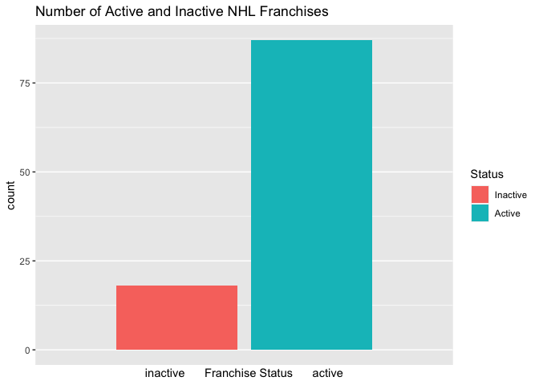

Project 1 - Karen Lopez
================
September 18, 2020

-   [Reading and Summarizing Data from the NHL’s
    API](#reading-and-summarizing-data-from-the-nhls-api)
    -   [Required Packages](#required-packages)
    -   [Make Contact and Get Data](#make-contact-and-get-data)
        -   [Franchise API](#franchise-api)
        -   [Stats API](#stats-api)
    -   [Wrapper Function](#wrapper-function)
    -   [Exploratory Analysis](#exploratory-analysis)

Reading and Summarizing Data from the NHL’s API
===============================================

This vignette was compiled to provide detailed instructions on reading
and summarizing data from the National Hockey League’s, or NHL’s, API
using R code.

Required Packages
-----------------

First, install and read in the necessary packages, as shown below.
Packages only need to be installed once, but code is included in
comment.

    #install.packages("tidyverse")
    library(tidyverse)
    library(httr)
    library(jsonlite)
    library(dplyr)
    library(knitr)

Make Contact and Get Data
-------------------------

This code contains functions that will contact the [NHL records
API](https://gitlab.com/dword4/nhlapi/-/blob/master/records-api.md) and
[NHL stat
API](https://gitlab.com/dword4/nhlapi/-/blob/master/stats-api.md), and
return parsed, well-formatted data.

### Franchise API

    #function that creates the url for the records API
    getUrl <- function(input){
      baseUrl <- "https://records.nhl.com/site/api/franchise"
      table <- input
      fullURL <- paste0(baseUrl, table) #create url
    }

    franchise <- function(){
      franchiseAPI <- GET(getUrl(NULL)) #get url to grab data
      franchiseAPI #check connection
      
      franchiseText <- content(franchiseAPI, "text") #convert to JSON text form
      #franchiseText #check dataset
      franchiseList <- fromJSON(franchiseText, flatten=TRUE) #convert form
      franchiseDF <- as.data.frame(franchiseList) #convert to df, adds .data to col names
      #franchiseDF #check dataset
      colnames(franchiseDF) <- c("id", "firstSeasonId", "lastSeasonId", "mostRecentTeamId", "teamCommonName", "teamPlaceName", "total") #rename columns
      
      return(franchiseDF)
    }
    franchiseData <- franchise() #save data frame object (used in other functions later)
    #print(kable(franchiseData))

    teamTotals <- function(){
      teamAPI <- GET(getUrl("-team-totals"))
      teamAPI #check connection
      
      teamText <- content(teamAPI, "text") #convert to JSON text form
      #teamText #check dataset
      teamList <- fromJSON(teamText, flatten=TRUE) #convert form
      teamDF <- as.data.frame(teamList)
      #teamList #check dataset
      colnames(teamDF) <- c("id", "activeFranchise", "firstSeasonId", "franchiseId", "gameTypeId", "gamesPlayed", "goalsAgainst", "goalsFor", "homeLosses", "homeOvertimeLosses", "homeTies", "homeWins", "lastSeasonId", "losses","overtimeLosses", "penaltyMinutes", "pointPctg", "points", "roadLosses", "roadOvertimeLosses", "roadTies", "roadWins", "shootoutLosses", "shootoutWins",  "shutouts", "teamId", "teamName", "ties", "triCode", "wins", "total")
      
      return(teamDF)
    }
    #teamsT <- teamTotals() #test that function works
    #print(kable(teamsT))

    #function that return numeric team ID when supplied with team name
    getID <- function(teamName){
      teamData <- data.frame()
      teamID <- NULL
      if(teamName %in% franchiseData$teamCommonName){
        #print(paste0(teamName, " is common name")) #test code
        teamData <- franchiseData %>% filter(franchiseData$teamCommonName==teamName)
        teamID <- teamData$id
      } else if(teamName %in% franchiseData$teamPlaceName){
        #print(paste0(teamName, " is place name")) #test code
        teamData <- franchiseData %>% filter(franchiseData$teamPlaceName==teamName)
        teamID <- teamData$id
      } else {print("Please enter valid team name.")}
      return(teamID)
    }

    seasonRecords <- function(ID){
      url <- ""
      if(is.numeric(ID)){
        url <- paste0("-season-records?cayenneExp=franchiseId=", ID)
      } else if(is.character(ID)){
        ID = getID(ID)
        url <- paste0("-season-records?cayenneExp=franchiseId=", ID)
      }
      #url = "-season-records" #view the 38 teams that have stats
      #print(url) #test code
      seasonAPI <- GET(getUrl(url))
      seasonAPI #check connection
      
      seasonText <- content(seasonAPI, "text") #convert to JSON text form
      seasonText #check dataset
      seasonList <- fromJSON(seasonText, flatten=TRUE) #convert form
      #seasonList #check dataset
      seasonDF <- as.data.frame(seasonList)
      #seasonList #check dataset
      colnames(seasonDF) <- c("id", "fewestGoals", "fewestGoalsAgainst", "fewestGoalsAgainstSeasons", "fewestGoalsSeasons", "fewestLosses", "fewestLossesSeasons", "fewestPoints", "fewestPointsSeasons", "fewestTies", "fewestTiesSeasons", "fewestWins", "fewestWinsSeasons", "franchiseId", "franchiseName", "homeLossStreak", "homeLossStreakDates", "homePointStreak", "homePointStreakDates", "homeWinStreak", "homeWinStreakDates", "homeWinlessStreak", "homeWinlessStreakDates", "lossStreak", "lossStreakDates", "mostGameGoals", "mostGameGoalsDates", "mostGoals", "mostGoalsAgainst", "mostGoalsAgainstSeasons", "mostGoalsSeasons", "mostLosses", "mostLossesSeasons", "mostPenaltyMinutes", "mostPenaltyMinutesSeasons", "mostPoints", "mostPointsSeasons", "mostShutouts", "mostShutoutsSeasons", "mostTies", "mostTiesSeasons", "mostWins", "mostWinsSeasons", "pointStreak", "pointStreakDates", "roadLossStreak", "roadLossStreakDates", "roadPointStreak", "roadPointStreakDates", "roadWinStreak", "roadWinStreakDates", "roadWinlessStreak", "roadWinlessStreakDates", "winStreak", "winStreakDates", "winlessStreak", "winlessStreakDates") #change df col names

      return(seasonDF)
    }
    #seasonRecord <- seasonRecords("Carolina") #test that function works
    #print(kable(seasonRecord))

    goalieRecords <- function(ID){
      url <- ""
      if(is.numeric(ID)){
        url <- paste0("-goalie-records?cayenneExp=franchiseId=", ID)
      } else if(is.character(ID)){
        ID = getID(ID)
        url <- paste0("-goalie-records?cayenneExp=franchiseId=", ID)
      }
      #url = "-goalie-records" #view the goalies that have stats
      #print(url) #test code
      goalieAPI <- GET(getUrl(url))
      goalieAPI #check connection
      
      goalieText <- content(goalieAPI, "text") #convert to JSON text form
      goalieText #check dataset
      goalieList <- fromJSON(goalieText, flatten=TRUE) #convert form
      goalieList #check dataset

      goalieDF <- as.data.frame(goalieList)
      #goalieList #check dataset
      colnames(goalieDF) <- c("id", "activePlayer", "firstName", "franchiseId", "franchiseName", "gameTypeId", "gamesPlayed", "lastName", "losses", "mostGoalsAgainstDates", "mostGoalsAgainstOneGame", "mostSavesDates", "mostSavesOneGame", "mostShotsAgainstDates", "mostShotsAgainstOneGame", "mostShutoutsOneSeason", "mostShutoutsSeasonIds", "mostWinsOneSeason", "mostWinsSeasonIds", "overtimeLosses", "playerId", "positionCode", "rookieGamesPlayed", "rookieShutouts", "rookieWins", "seasons", "shutouts", "ties", "dwins", "total") #change df col names

      return(goalieDF)
    }
    #goalieRecord <- goalieRecords("Carolina") #test that function works
    #print(kable(goalieRecord))

    skaterRecords <- function(ID){
      url <- ""
      if(is.numeric(ID)){
        url <- paste0("-skater-records?cayenneExp=franchiseId=", ID)
      } else if(is.character(ID)){
        ID = getID(ID)
        url <- paste0("-skater-records?cayenneExp=franchiseId=", ID)
      }
      
      #url = "-skater-records" #view the skaters that have stats
      #print(url) #test code
      skaterAPI <- GET(getUrl(url))
      #skaterAPI #check connection

      skaterText <- content(skaterAPI, "text") #convert to JSON text form
      #skaterText #check dataset
      skaterList <- fromJSON(skaterText, flatten=TRUE) #convert form
      #skaterList #check dataset
      
      skaterDF <- as.data.frame(skaterList)
      #skaterList #check dataset
      colnames(skaterDF) <- c("id", "activePlayer", "assists", "firstName", "franchiseId", "franchiseName", "gameTypeId", "gamesPlayed", "goals", "lastName", "mostAssistsGameDates", "mostAssistsOneGame", "mostAssistsOneSeason", "mostAssistsSeasonIds", "mostGoalsGameDates", "mostGoalsOneGame", "mostGoalsOneSeason", "mostGoalsSeasonIds", "mostPenaltyMinutesOneSeason", "mostPenaltyMinutesSeasonIds", "mostPointsGameDates", "mostPointsOneGame", "mostPointsOneSeason", "mostPointsSeasonIds", "penaltyMinutes", "playerId", "points", "positionCode", "rookiePoints", "seasons", "total") #change df col names

      return(skaterDF)
    }
    #skaterRecord <- skaterRecords(9) #test that function works
    #print(kable(skaterRecord))

### Stats API

The user is required to input a team ID or name and modifier to access
the desired data. This string input format isn’t ideal, but is corrected
in the wrapper function.  
Input guide for modifiers, copied from API website:  
-?expand=team.roster Shows roster of active players for the specified
team  
-?expand=person.names Same as above, but gives less info  
-?expand=team.schedule.next Returns details of the upcoming game for a
team  
-?expand=team.schedule.previous Same as above but for the last game
played  
-?expand=team.stats Returns the teams stats for the season  
-?expand=team.roster&season=20142015 Adding the season identifier shows
the roster for that season  
-?teamId=4,5,29 Can string team id together to get multiple teams

    #from stats API
    teams <- function(ID, input){
      url <- ""
      if(is.numeric(ID)){
        url <- paste0("https://statsapi.web.nhl.com/api/v1/teams/", ID, "/", input)
      } else if(is.character(ID)){
        ID = getID(ID)
        url <- paste0("https://statsapi.web.nhl.com/api/v1/teams/", ID, "/", input)
      }
      
      #print(url)
      teamsAPI <- GET(url)
      teamsAPI #check connection

      teamsText <- content(teamsAPI, "text") #convert to JSON text form
      teamsText #check dataset
      teamsList <- fromJSON(teamsText, flatten=TRUE) #convert form
      #teamsList #check dataset
      
      teamsDF <- as.data.frame(teamsList)
      #teamsList #check dataset
      #colnames(teamsDF) <- c() #change df col names

      return(teamsDF)
    }
    #teamsRecord <- teams(12,"?expand=person.names") #test that function works
    #print(kable(teamsRecord))

    #teamsRecord2 <- teams(54,"?expand=team.schedule.next") #test that function works
    #print(kable(teamsRecord2))

    #API returns the same team information table across the different modifiers with nested data frame(s) that contain the modifier data. On the discussion board, the instructor noted we can print the output as is and that we shouldn't worry about the last modifier, so I omitted modifier 13 (?stats=statsSingleSeasonPlayoffs).

    #first 7 of 8 modifiers list:https://gitlab.com/dword4/nhlapi/-/blob/master/stats-api.md#teams  

Wrapper Function
----------------

This wrapper function allows the user to access any of the API endpoints
and modifiers included in the above code. The user must input the
endpoint and team ID or name, where team input is applicable. The
endpoints have been coded by numerbers, making user input more friendly.

Endpoint input guide, number 1-5 are from the Records API and numbers
6-12 are from the Stats API: -1: franchise information for all teams  
-2: team totals for all teams  
-3: season records for a team (must specify team ID or name)  
-4: goalie records for a team (must specify team ID or name)  
-5: skater records for a team (must specify team ID or name)  
-6: team roster of active players for a team (must specify team ID or
name)  
-7: active player names for a team (must specify team ID or name)  
-8: upcoming game for a team (must specify team ID or name)  
-9: last game played for a team (must specify team ID or name)  
-10: season stats for a team (must specify team ID or name)  
-11: roster by season for a team (must specify team ID or name)  
-12: franchise information for multiple teams (must specify team IDs or
names)

    accessAPI <- function(endpoint, team=NULL){
      outputDF <- NULL #create output object
      
      #check if team name is character or valid number, get numeric ID if character
      if(is.null(team)){
      } else if(is.character(team)){
        team = getID(team)
      } else if(!is.numeric(team)){
        print("Please enter valid team name or ID.")
      }
      
      #check if endpoint is valid, get url based on endpoint input
      if(endpoint==1){
        outputDF <- franchise()
      } else if(endpoint==2){
        outputDF <- teamTotals()
      } else if(endpoint==3){
        outputDF <- seasonRecords(team)
      } else if(endpoint==4){
        outputDF <- goalieRecords(team)
      } else if(endpoint==5){
        outputDF <- skaterRecords(team)
      } else if(endpoint==6){
        outputDF <- teams(team, "?expand=team.roster")
      } else if(endpoint==7){
        outputDF <- teams(team, "?expand=person.names")
      } else if(endpoint==8){
        outputDF <- teams(team, "?expand=team.schedule.next")
      } else if(endpoint==9){
        outputDF <- teams(team, "?expand=team.schedule.previous")
      } else if(endpoint==10){
        outputDF <- teams(team, "?expand=team.stats")
      } else if(endpoint==11){
        outputDF <- teams(team, "?expand=team.roster&season=20142015")
      } else if(endpoint==12){
        outputDF <- teams(team, "?teamId=4,5,29")
      } else {
        print("Please enter a valid number endpoint or modifier between 1 and 13.")
      }
    return(outputDF)
    }
    #test code, all work
    #franchise1 <- accessAPI(1)
    #print(head(franchise1))

    #goalie1<- accessAPI(4, "Carolina")
    #print(head(goalie1))

    #roster1 <- accessAPI(6, team=12)
    #print(roster1)

Exploratory Analysis
--------------------

Once you have the functions to query the data, you should perform a
basic exploratory data analysis. Not all things reported need to show
something interesting or meaningful (i.e. graphs that show no
relationship are fine) but you should discuss each graph (if you don’t
know hockey, that is ok - simply discuss the graphs and summaries as
best you can). A few requirements are below:

    #join goalie records and skater records for Boston Bruins
    goaliesB <- accessAPI(4, team="Boston")
    skatersB <- accessAPI(5, team="Boston")
    playersB <- bind_rows(goaliesB, skatersB)
    combo <- bind_rows(head(playersB),tail(playersB)) #join first 6 and low 4 rows because viewing entire data set is too much for the knit document to create
    print(kable(combo))

    ## 
    ## 
    ## |    id|activePlayer |firstName | franchiseId|franchiseName | gameTypeId| gamesPlayed|lastName   | losses|mostGoalsAgainstDates                                      | mostGoalsAgainstOneGame|mostSavesDates | mostSavesOneGame|mostShotsAgainstDates  | mostShotsAgainstOneGame| mostShutoutsOneSeason|mostShutoutsSeasonIds | mostWinsOneSeason|mostWinsSeasonIds | overtimeLosses| playerId|positionCode | rookieGamesPlayed| rookieShutouts| rookieWins| seasons| shutouts| ties| dwins| total| assists| goals|mostAssistsGameDates                                                                                                                                                                                                                                                                                                                                                                                                                                                                                                                                                                                                                                                                                       | mostAssistsOneGame| mostAssistsOneSeason|mostAssistsSeasonIds |mostGoalsGameDates                                                                                                                                                                                                                                                                                                                                                                                                                                                                                                                                                                                                                                                                                         | mostGoalsOneGame| mostGoalsOneSeason|mostGoalsSeasonIds | mostPenaltyMinutesOneSeason|mostPenaltyMinutesSeasonIds |mostPointsGameDates                                                                                                                                                                                                                                                                                                                                                                                                                                                                                                                                                                                                                                                                                        | mostPointsOneGame| mostPointsOneSeason|mostPointsSeasonIds | penaltyMinutes| points| rookiePoints|
    ## |-----:|:------------|:---------|-----------:|:-------------|----------:|-----------:|:----------|------:|:----------------------------------------------------------|-----------------------:|:--------------|----------------:|:----------------------|-----------------------:|---------------------:|:---------------------|-----------------:|:-----------------|--------------:|--------:|:------------|-----------------:|--------------:|----------:|-------:|--------:|----:|-----:|-----:|-------:|-----:|:----------------------------------------------------------------------------------------------------------------------------------------------------------------------------------------------------------------------------------------------------------------------------------------------------------------------------------------------------------------------------------------------------------------------------------------------------------------------------------------------------------------------------------------------------------------------------------------------------------------------------------------------------------------------------------------------------------|------------------:|--------------------:|:--------------------|:----------------------------------------------------------------------------------------------------------------------------------------------------------------------------------------------------------------------------------------------------------------------------------------------------------------------------------------------------------------------------------------------------------------------------------------------------------------------------------------------------------------------------------------------------------------------------------------------------------------------------------------------------------------------------------------------------------|----------------:|------------------:|:------------------|---------------------------:|:---------------------------|:----------------------------------------------------------------------------------------------------------------------------------------------------------------------------------------------------------------------------------------------------------------------------------------------------------------------------------------------------------------------------------------------------------------------------------------------------------------------------------------------------------------------------------------------------------------------------------------------------------------------------------------------------------------------------------------------------------|-----------------:|-------------------:|:-------------------|--------------:|------:|------------:|
    ## |   247|FALSE        |Gerry     |           6|Boston Bruins |          2|         416|Cheevers   |    103|1977-02-12, 1970-01-24, 1966-12-04, 1965-12-15, 1965-12-11 |                       8|1969-02-06     |               45|1969-02-06             |                      48|                     4|19691970, 19791980    |                30|19761977          |             NA|  8449853|G            |                22|              1|          5|      12|       26|   76|   226|    51|      NA|    NA|NA                                                                                                                                                                                                                                                                                                                                                                                                                                                                                                                                                                                                                                                                                                         |                 NA|                   NA|NA                   |NA                                                                                                                                                                                                                                                                                                                                                                                                                                                                                                                                                                                                                                                                                                         |               NA|                 NA|NA                 |                          NA|NA                          |NA                                                                                                                                                                                                                                                                                                                                                                                                                                                                                                                                                                                                                                                                                                         |                NA|                  NA|NA                  |             NA|     NA|           NA|
    ## |   290|FALSE        |Tiny      |           6|Boston Bruins |          2|         468|Thompson   |    153|1934-02-24, 1934-01-04                                     |                       9|NA             |               NA|NA                     |                      NA|                    12|19281929              |                38|19291930          |             NA|  8450127|G            |                44|             12|         26|      11|       74|   63|   252|    51|      NA|    NA|NA                                                                                                                                                                                                                                                                                                                                                                                                                                                                                                                                                                                                                                                                                                         |                 NA|                   NA|NA                   |NA                                                                                                                                                                                                                                                                                                                                                                                                                                                                                                                                                                                                                                                                                                         |               NA|                 NA|NA                 |                          NA|NA                          |NA                                                                                                                                                                                                                                                                                                                                                                                                                                                                                                                                                                                                                                                                                                         |                NA|                  NA|NA                  |             NA|     NA|           NA|
    ## |   300|FALSE        |Eddie     |           6|Boston Bruins |          2|         444|Johnston   |    192|1967-03-15                                                 |                      11|1965-01-03     |               48|1965-01-03             |                      56|                     6|19631964              |                30|19701971          |             NA|  8450005|G            |                50|              1|         11|      11|       27|   54|   182|    51|      NA|    NA|NA                                                                                                                                                                                                                                                                                                                                                                                                                                                                                                                                                                                                                                                                                                         |                 NA|                   NA|NA                   |NA                                                                                                                                                                                                                                                                                                                                                                                                                                                                                                                                                                                                                                                                                                         |               NA|                 NA|NA                 |                          NA|NA                          |NA                                                                                                                                                                                                                                                                                                                                                                                                                                                                                                                                                                                                                                                                                                         |                NA|                  NA|NA                  |             NA|     NA|           NA|
    ## |   321|TRUE         |Tuukka    |           6|Boston Bruins |          2|         536|Rask       |    158|2014-12-04                                                 |                       7|2014-03-30     |               49|2014-03-30             |                      52|                     8|20162017              |                37|20162017          |             64|  8471695|G            |                45|              5|         22|      13|       50|    0|   291|    51|      NA|    NA|NA                                                                                                                                                                                                                                                                                                                                                                                                                                                                                                                                                                                                                                                                                                         |                 NA|                   NA|NA                   |NA                                                                                                                                                                                                                                                                                                                                                                                                                                                                                                                                                                                                                                                                                                         |               NA|                 NA|NA                 |                          NA|NA                          |NA                                                                                                                                                                                                                                                                                                                                                                                                                                                                                                                                                                                                                                                                                                         |                NA|                  NA|NA                  |             NA|     NA|           NA|
    ## |   347|FALSE        |Yves      |           6|Boston Bruins |          2|           8|Belanger   |      0|1979-10-23                                                 |                       5|1979-11-02     |               24|1979-11-02             |                      27|                     0|19791980              |                 2|19791980          |             NA|  8445403|G            |                NA|             NA|         NA|       1|        0|    3|     2|    51|      NA|    NA|NA                                                                                                                                                                                                                                                                                                                                                                                                                                                                                                                                                                                                                                                                                                         |                 NA|                   NA|NA                   |NA                                                                                                                                                                                                                                                                                                                                                                                                                                                                                                                                                                                                                                                                                                         |               NA|                 NA|NA                 |                          NA|NA                          |NA                                                                                                                                                                                                                                                                                                                                                                                                                                                                                                                                                                                                                                                                                                         |                NA|                  NA|NA                  |             NA|     NA|           NA|
    ## |   352|FALSE        |Daniel    |           6|Boston Bruins |          2|           8|Berthiaume |      4|1992-03-08, 1992-01-25                                     |                       4|1992-03-07     |               26|1992-03-07, 1992-01-23 |                      28|                     0|19911992              |                 1|19911992          |             NA|  8445462|G            |                NA|             NA|         NA|       1|        0|    2|     1|    51|      NA|    NA|NA                                                                                                                                                                                                                                                                                                                                                                                                                                                                                                                                                                                                                                                                                                         |                 NA|                   NA|NA                   |NA                                                                                                                                                                                                                                                                                                                                                                                                                                                                                                                                                                                                                                                                                                         |               NA|                 NA|NA                 |                          NA|NA                          |NA                                                                                                                                                                                                                                                                                                                                                                                                                                                                                                                                                                                                                                                                                                         |                NA|                  NA|NA                  |             NA|     NA|           NA|
    ## | 33653|TRUE         |Par       |           6|Boston Bruins |          2|          40|Lindholm   |     NA|NA                                                         |                      NA|NA             |               NA|NA                     |                      NA|                    NA|NA                    |                NA|NA                |             NA|  8480944|C            |                NA|             NA|         NA|       1|       NA|   NA|    NA|   910|       3|     3|2020-01-07, 2020-02-01, 2020-02-25                                                                                                                                                                                                                                                                                                                                                                                                                                                                                                                                                                                                                                                                         |                  1|                    3|20192020             |2019-10-22, 2019-12-21, 2020-01-16                                                                                                                                                                                                                                                                                                                                                                                                                                                                                                                                                                                                                                                                         |                1|                  3|20192020           |                           4|20192020                    |2019-10-22, 2019-12-21, 2020-01-07, 2020-01-16, 2020-02-01, 2020-02-25                                                                                                                                                                                                                                                                                                                                                                                                                                                                                                                                                                                                                                     |                 1|                   6|20192020            |              4|      6|           NA|
    ## | 33781|TRUE         |Cameron   |           6|Boston Bruins |          2|           1|Hughes     |     NA|NA                                                         |                      NA|NA             |               NA|NA                     |                      NA|                    NA|NA                    |                NA|NA                |             NA|  8478888|C            |                NA|             NA|         NA|       1|       NA|   NA|    NA|   910|       0|     0|2019-11-04, 2019-11-05, 2019-11-08, 2019-11-10, 2019-11-12, 2019-11-15, 2019-11-16, 2019-11-19, 2019-11-21, 2019-11-23, 2019-11-26, 2019-11-27, 2019-11-29, 2019-12-01, 2019-12-03, 2019-12-05, 2019-12-07, 2019-12-09, 2019-12-11, 2019-12-12, 2019-12-14, 2019-12-17, 2019-12-19, 2019-12-21, 2019-12-23, 2019-12-27, 2019-12-29, 2019-12-31, 2020-01-02, 2020-01-04, 2020-01-07, 2020-01-09, 2020-01-11, 2020-01-13, 2020-01-14, 2020-01-16, 2020-01-19, 2020-01-21, 2020-01-31, 2020-02-01, 2020-02-04, 2020-02-05, 2020-02-08, 2020-02-09, 2020-02-12, 2020-02-15, 2020-02-16, 2020-02-19, 2020-02-21, 2020-02-22, 2020-02-25, 2020-02-27, 2020-02-29, 2020-03-03, 2020-03-05, 2020-03-07, 2020-03-10 |                  0|                    0|20192020             |2019-11-04, 2019-11-05, 2019-11-08, 2019-11-10, 2019-11-12, 2019-11-15, 2019-11-16, 2019-11-19, 2019-11-21, 2019-11-23, 2019-11-26, 2019-11-27, 2019-11-29, 2019-12-01, 2019-12-03, 2019-12-05, 2019-12-07, 2019-12-09, 2019-12-11, 2019-12-12, 2019-12-14, 2019-12-17, 2019-12-19, 2019-12-21, 2019-12-23, 2019-12-27, 2019-12-29, 2019-12-31, 2020-01-02, 2020-01-04, 2020-01-07, 2020-01-09, 2020-01-11, 2020-01-13, 2020-01-14, 2020-01-16, 2020-01-19, 2020-01-21, 2020-01-31, 2020-02-01, 2020-02-04, 2020-02-05, 2020-02-08, 2020-02-09, 2020-02-12, 2020-02-15, 2020-02-16, 2020-02-19, 2020-02-21, 2020-02-22, 2020-02-25, 2020-02-27, 2020-02-29, 2020-03-03, 2020-03-05, 2020-03-07, 2020-03-10 |                0|                  0|20192020           |                           0|20192020                    |2019-11-04, 2019-11-05, 2019-11-08, 2019-11-10, 2019-11-12, 2019-11-15, 2019-11-16, 2019-11-19, 2019-11-21, 2019-11-23, 2019-11-26, 2019-11-27, 2019-11-29, 2019-12-01, 2019-12-03, 2019-12-05, 2019-12-07, 2019-12-09, 2019-12-11, 2019-12-12, 2019-12-14, 2019-12-17, 2019-12-19, 2019-12-21, 2019-12-23, 2019-12-27, 2019-12-29, 2019-12-31, 2020-01-02, 2020-01-04, 2020-01-07, 2020-01-09, 2020-01-11, 2020-01-13, 2020-01-14, 2020-01-16, 2020-01-19, 2020-01-21, 2020-01-31, 2020-02-01, 2020-02-04, 2020-02-05, 2020-02-08, 2020-02-09, 2020-02-12, 2020-02-15, 2020-02-16, 2020-02-19, 2020-02-21, 2020-02-22, 2020-02-25, 2020-02-27, 2020-02-29, 2020-03-03, 2020-03-05, 2020-03-07, 2020-03-10 |                 0|                   0|20192020            |              0|      0|            0|
    ## | 33804|TRUE         |Jack      |           6|Boston Bruins |          2|           2|Studnicka  |     NA|NA                                                         |                      NA|NA             |               NA|NA                     |                      NA|                    NA|NA                    |                NA|NA                |             NA|  8480021|C            |                NA|             NA|         NA|       1|       NA|   NA|    NA|   910|       1|     0|2019-11-26                                                                                                                                                                                                                                                                                                                                                                                                                                                                                                                                                                                                                                                                                                 |                  1|                    1|20192020             |2019-11-26, 2019-11-27, 2019-11-29, 2019-12-01, 2019-12-03, 2019-12-05, 2019-12-07, 2019-12-09, 2019-12-11, 2019-12-12, 2019-12-14, 2019-12-17, 2019-12-19, 2019-12-21, 2019-12-23, 2019-12-27, 2019-12-29, 2019-12-31, 2020-01-02, 2020-01-04, 2020-01-07, 2020-01-09, 2020-01-11, 2020-01-13, 2020-01-14, 2020-01-16, 2020-01-19, 2020-01-21, 2020-01-31, 2020-02-01, 2020-02-04, 2020-02-05, 2020-02-08, 2020-02-09, 2020-02-12, 2020-02-15, 2020-02-16, 2020-02-19, 2020-02-21, 2020-02-22, 2020-02-25, 2020-02-27, 2020-02-29, 2020-03-03, 2020-03-05, 2020-03-07, 2020-03-10                                                                                                                         |                0|                  0|20192020           |                           2|20192020                    |2019-11-26                                                                                                                                                                                                                                                                                                                                                                                                                                                                                                                                                                                                                                                                                                 |                 1|                   1|20192020            |              2|      1|            1|
    ## | 33805|TRUE         |Brendan   |           6|Boston Bruins |          2|           1|Gaunce     |     NA|NA                                                         |                      NA|NA             |               NA|NA                     |                      NA|                    NA|NA                    |                NA|NA                |             NA|  8476867|C            |                NA|             NA|         NA|       1|       NA|   NA|    NA|   910|       1|     0|2019-11-27                                                                                                                                                                                                                                                                                                                                                                                                                                                                                                                                                                                                                                                                                                 |                  1|                    1|20192020             |2019-11-27, 2019-11-29, 2019-12-01, 2019-12-03, 2019-12-05, 2019-12-07, 2019-12-09, 2019-12-11, 2019-12-12, 2019-12-14, 2019-12-17, 2019-12-19, 2019-12-21, 2019-12-23, 2019-12-27, 2019-12-29, 2019-12-31, 2020-01-02, 2020-01-04, 2020-01-07, 2020-01-09, 2020-01-11, 2020-01-13, 2020-01-14, 2020-01-16, 2020-01-19, 2020-01-21, 2020-01-31, 2020-02-01, 2020-02-04, 2020-02-05, 2020-02-08, 2020-02-09, 2020-02-12, 2020-02-15, 2020-02-16, 2020-02-19, 2020-02-21, 2020-02-22, 2020-02-25, 2020-02-27, 2020-02-29, 2020-03-03, 2020-03-05, 2020-03-07, 2020-03-10                                                                                                                                     |                0|                  0|20192020           |                           2|20192020                    |2019-11-27                                                                                                                                                                                                                                                                                                                                                                                                                                                                                                                                                                                                                                                                                                 |                 1|                   1|20192020            |              2|      1|           NA|
    ## | 33917|TRUE         |Nick      |           6|Boston Bruins |          2|           7|Ritchie    |     NA|NA                                                         |                      NA|NA             |               NA|NA                     |                      NA|                    NA|NA                    |                NA|NA                |             NA|  8477941|L            |                NA|             NA|         NA|       1|       NA|   NA|    NA|   910|       1|     1|2020-02-27                                                                                                                                                                                                                                                                                                                                                                                                                                                                                                                                                                                                                                                                                                 |                  1|                    1|20192020             |2020-02-27                                                                                                                                                                                                                                                                                                                                                                                                                                                                                                                                                                                                                                                                                                 |                1|                  1|20192020           |                          19|20192020                    |2020-02-27                                                                                                                                                                                                                                                                                                                                                                                                                                                                                                                                                                                                                                                                                                 |                 2|                   2|20192020            |             19|      2|           NA|
    ## | 33927|TRUE         |Ondrej    |           6|Boston Bruins |          2|           6|Kase       |     NA|NA                                                         |                      NA|NA             |               NA|NA                     |                      NA|                    NA|NA                    |                NA|NA                |             NA|  8478131|R            |                NA|             NA|         NA|       1|       NA|   NA|    NA|   910|       1|     0|2020-03-07                                                                                                                                                                                                                                                                                                                                                                                                                                                                                                                                                                                                                                                                                                 |                  1|                    1|20192020             |2020-02-27, 2020-02-29, 2020-03-03, 2020-03-05, 2020-03-07, 2020-03-10                                                                                                                                                                                                                                                                                                                                                                                                                                                                                                                                                                                                                                     |                0|                  0|20192020           |                           4|20192020                    |2020-03-07                                                                                                                                                                                                                                                                                                                                                                                                                                                                                                                                                                                                                                                                                                 |                 1|                   1|20192020            |              4|      1|           NA|

    #add ratio of most goals against versus saves for the Carolina Hurricanse
    goaliesC <- accessAPI(4, "Carolina")
    goaliesC <- goaliesC %>% mutate(ratio=mostGoalsAgainstOneGame/mostSavesOneGame)
    print(kable(head(goaliesC)))

    ## 
    ## 
    ## |  id|activePlayer |firstName | franchiseId|franchiseName       | gameTypeId| gamesPlayed|lastName    | losses|mostGoalsAgainstDates              | mostGoalsAgainstOneGame|mostSavesDates | mostSavesOneGame|mostShotsAgainstDates  | mostShotsAgainstOneGame| mostShutoutsOneSeason|mostShutoutsSeasonIds | mostWinsOneSeason|mostWinsSeasonIds | overtimeLosses| playerId|positionCode | rookieGamesPlayed| rookieShutouts| rookieWins| seasons| shutouts| ties| dwins| total|     ratio|
    ## |---:|:------------|:---------|-----------:|:-------------------|----------:|-----------:|:-----------|------:|:----------------------------------|-----------------------:|:--------------|----------------:|:----------------------|-----------------------:|---------------------:|:---------------------|-----------------:|:-----------------|--------------:|--------:|:------------|-----------------:|--------------:|----------:|-------:|--------:|----:|-----:|-----:|---------:|
    ## | 277|FALSE        |Cam       |          26|Carolina Hurricanes |          2|         668|Ward        |    244|2017-01-20, 2007-01-27, 2005-11-12 |                       7|2008-10-25     |               57|2008-10-25             |                      60|                     6|20082009              |                39|20082009          |             84|  8470320|G            |                28|              0|         14|      13|       27|    0|   318|    38| 0.1228070|
    ## | 310|FALSE        |Arturs    |          26|Carolina Hurricanes |          2|         309|Irbe        |    122|2002-01-12                         |                       7|1999-01-30     |               44|1999-01-30             |                      45|                     6|19981999, 20002001    |                37|20002001          |             NA|  8456692|G            |                NA|             NA|         NA|       6|       20|   44|   130|    38| 0.1590909|
    ## | 336|FALSE        |Tom       |          26|Carolina Hurricanes |          2|          34|Barrasso    |     12|2001-12-30, 2001-12-18, 2001-11-29 |                       5|2001-12-10     |               40|2001-12-10             |                      43|                     2|20012002              |                13|20012002          |             NA|  8445275|G            |                NA|             NA|         NA|       1|        2|    5|    13|    38| 0.1250000|
    ## | 363|FALSE        |Richard   |          26|Carolina Hurricanes |          2|           6|Brodeur     |      2|1988-03-09                         |                       4|1988-04-03     |               31|1988-04-03             |                      34|                     0|19871988              |                 4|19871988          |             NA|  8445694|G            |                NA|             NA|         NA|       1|        0|    0|     4|    38| 0.1290323|
    ## | 369|FALSE        |Sean      |          26|Carolina Hurricanes |          2|         256|Burke       |    120|1992-12-11                         |                       9|1994-01-01     |               51|1996-01-27, 1994-01-01 |                      54|                     4|19951996, 19961997    |                28|19951996          |             NA|  8445769|G            |                NA|             NA|         NA|       6|       10|   24|   100|    38| 0.1764706|
    ## | 411|FALSE        |Mark      |          26|Carolina Hurricanes |          2|           3|Fitzpatrick |      2|2000-02-15                         |                       5|2000-02-15     |               40|2000-02-15             |                      45|                     0|19992000              |                 0|19992000          |             NA|  8446829|G            |                NA|             NA|         NA|       1|        0|    0|     0|    38| 0.1250000|

    #add column to Atlanta Thrashers for the mascot name
    rosterA <- accessAPI(6, team=11)
    rosterA <- rosterA %>% mutate(mascot="Thrash")
    print(kable(rosterA))

    ## 
    ## 
    ## |copyright                                                                                                                                                                          | teams.id|teams.name        |teams.link       |teams.abbreviation |teams.teamName |teams.locationName |teams.firstYearOfPlay |teams.shortName |teams.officialSiteUrl            | teams.franchiseId|teams.active |teams.venue.name |teams.venue.link    |teams.venue.city |teams.venue.timeZone.id | teams.venue.timeZone.offset|teams.venue.timeZone.tz |teams.division.link    |teams.conference.link    | teams.franchise.franchiseId|teams.franchise.teamName |teams.franchise.link  |mascot |
    ## |:----------------------------------------------------------------------------------------------------------------------------------------------------------------------------------|--------:|:-----------------|:----------------|:------------------|:--------------|:------------------|:---------------------|:---------------|:--------------------------------|-----------------:|:------------|:----------------|:-------------------|:----------------|:-----------------------|---------------------------:|:-----------------------|:----------------------|:------------------------|---------------------------:|:------------------------|:---------------------|:------|
    ## |NHL and the NHL Shield are registered trademarks of the National Hockey League. NHL and NHL team marks are the property of the NHL and its teams. © NHL 2020. All Rights Reserved. |       11|Atlanta Thrashers |/api/v1/teams/11 |ATL                |Thrashers      |Atlanta            |1997                  |Atlanta         |http://www.atlantathrashers.com/ |                35|FALSE        |Philips Arena    |/api/v1/venues/null |Atlanta          |America/New_York        |                          -4|EDT                     |/api/v1/divisions/null |/api/v1/conferences/null |                          35|Jets                     |/api/v1/franchises/35 |Thrash |

    #view game type counts from team totals
    #1 is pre-season, 2 is regular season, 3 is post-season")
    teamTots <- accessAPI(2)
    table(kable(teamTots$gameTypeId))

    ## 
    ## |  2| |  3| |  x| |--:| 
    ##    57    48     1     1

    #view active(1) vs inactive(0) franchises from team totals
    table(kable(teamTots$activeFranchise))

    ## 
    ## |  0| |  1| |  x| |--:| 
    ##    18    87     1     1

    #view how many goalies played in the same number of games for Boston Bruins
    table(kable(goaliesB$gamesPlayed))

    ## 
    ## |   1| |   2| |   4| |   5| |   7| |   8| |   x| |  18| |  23| |  24| |  25| 
    ##      3      4      1      2      1      3      1      1      2      1      1 
    ## |  27| |  28| |  29| |  32| |  35| |  36| |  40| |  41| |  43| |  49| |  57| 
    ##      1      1      2      1      1      1      1      2      1      1      1 
    ## |  67| |  71| |  77| |  91| | 102| | 141| | 154| | 171| | 183| | 237| | 261| 
    ##      1      1      1      1      1      1      1      1      1      1      1 
    ## | 277| | 283| | 378| | 416| | 444| | 468| | 536| |---:| 
    ##      1      1      1      1      2      1      1      1

    #summary of wins for all franchises
    print(summary(teamTots$wins))

    ##    Min. 1st Qu.  Median    Mean 3rd Qu.    Max. 
    ##     0.0    27.0   137.0   539.4   758.0  3449.0

    #view correlation between losses anf games played by Carolina Hurricanes goalies
    print(cor(goaliesC$losses, goaliesC$gamesPlayed))

    ## [1] 0.9873253

    #view average wins and losses by franchise id
    print(kable(teamTots %>% group_by(teamTots$franchiseId) %>% summarise(avgWins=mean(wins), avgLosses=mean(losses))))

    ## 
    ## 
    ## | teamTots$franchiseId|    avgWins|  avgLosses|
    ## |--------------------:|----------:|----------:|
    ## |                    1| 1941.50000| 1299.00000|
    ## |                    2|    1.00000|    5.00000|
    ## |                    3|   95.66667|   89.66667|
    ## |                    4|   25.50000|   49.00000|
    ## |                    5|  538.16667|  517.16667|
    ## |                    6| 1767.00000| 1359.50000|
    ## |                    7|  145.50000|  140.50000|
    ## |                    8|   87.00000|  137.66667|
    ## |                    9|   24.00000|   53.33333|
    ## |                   10| 1550.00000| 1479.50000|
    ## |                   11| 1528.00000| 1505.50000|
    ## |                   12|  549.16667|  473.83333|
    ## |                   13|   58.00000|  124.00000|
    ## |                   14|  922.00000|  972.50000|
    ## |                   15|  500.50000|  466.50000|
    ## |                   16| 1142.50000|  823.50000|
    ## |                   17| 1036.50000|  948.00000|
    ## |                   18| 1042.00000|  921.00000|
    ## |                   19|  957.00000|  831.00000|
    ## |                   20|  868.50000|  926.00000|
    ## |                   21|  461.00000|  400.50000|
    ## |                   22|  908.50000|  851.50000|
    ## |                   23|  330.40000|  338.80000|
    ## |                   24|  900.50000|  802.00000|
    ## |                   25|  797.00000|  713.00000|
    ## |                   26|  349.00000|  375.25000|
    ## |                   27|  404.50000|  362.25000|
    ## |                   28|  226.00000|  254.16667|
    ## |                   29|  584.00000|  507.00000|
    ## |                   30|  510.00000|  495.50000|
    ## |                   31|  518.00000|  499.50000|
    ## |                   32|  531.00000|  438.50000|
    ## |                   33|  435.50000|  442.50000|
    ## |                   34|  436.50000|  348.00000|
    ## |                   35|  176.50000|  182.25000|
    ## |                   36|  337.50000|  349.00000|
    ## |                   37|  375.50000|  316.50000|
    ## |                   38|   80.50000|   49.50000|

    #Create at least 5 plots utilizing coloring, grouping, etc. All should have nice labels & titles.

    #bar plot
    g <- ggplot(teamTots, aes(x=activeFranchise)) #create base plotting object
    g + geom_bar(aes(fill=as.factor(activeFranchise))) + labs(x="inactive      Franchise Status      active", title="Number of Active and Inactive NHL Franchises") + scale_x_discrete(labels=c("inactive", "active")) + scale_fill_discrete(name="Status", labels=c("Inactive","Active")) #add layers, but won't add labels because data is coded numerically

<!-- -->

    #histogram

    #box plot

    #scatter plot

    #any plot
